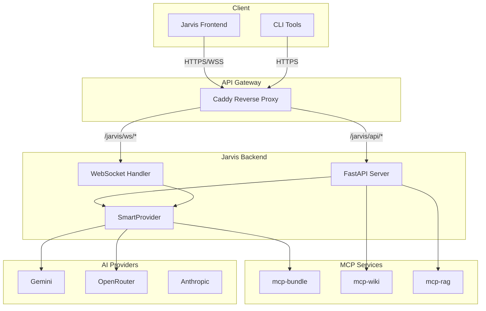
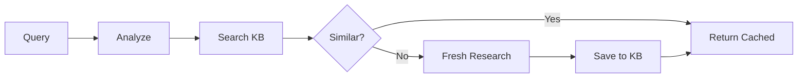
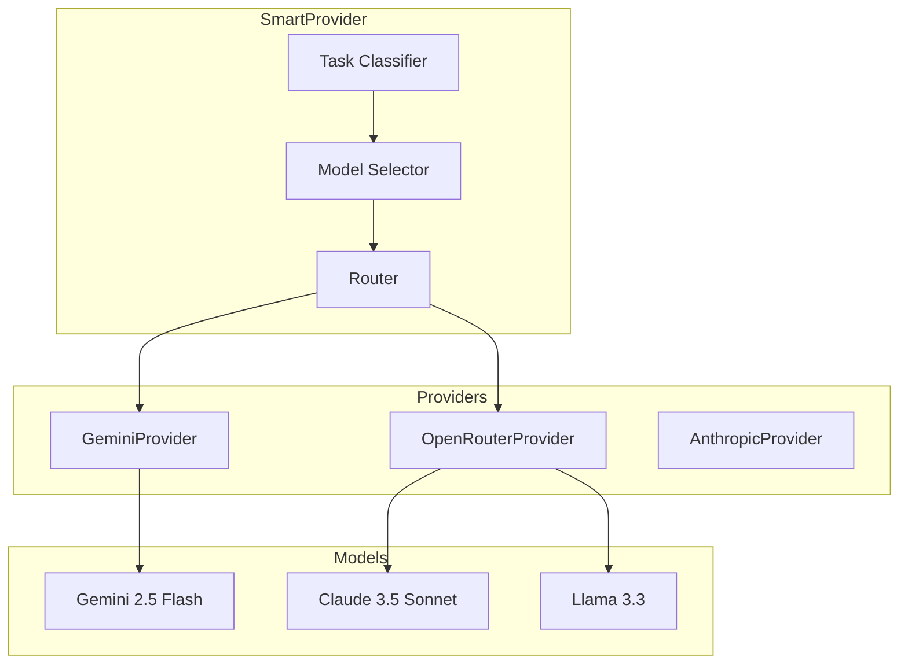

# Jarvis System Documentation

**Version:** 0.1.0  
**Last Updated:** April 10, 2026  
**Repository:** `tonezzz/chaba`  
**Main Branch:** `idc1-assistance`

## Table of Contents

1. [Architecture Overview](#architecture-overview)
2. [Core Services](#core-services)
3. [MCP Ecosystem](#mcp-ecosystem)
4. [Multi-Provider AI](#multi-provider-ai)
5. [Deployment](#deployment)
6. [API Reference](#api-reference)
7. [Development](#development)

---

## Architecture Overview



## Core Services

### Jarvis Backend (`services/assistance/jarvis-backend`)

FastAPI-based backend with:
- **WebSocket**: Real-time bidirectional communication
- **REST API**: CRUD operations for agents, models, providers
- **SmartProvider**: Task-aware model selection
- **MCP Integration**: Tool calling via MCP protocol

### Key Components

| Component | Path | Purpose |
|-----------|------|---------|
| `jarvis/models/` | Model abstraction layer | Task classification, model registry |
| `jarvis/providers/` | Multi-provider support | Gemini, OpenRouter, failover |
| `jarvis/websocket/` | Real-time comms | WebSocket session handling |
| `jarvis/api/` | REST endpoints | Agents, models, providers APIs |

---

## MCP Ecosystem

### mcp-wiki (Knowledge Base)

**Location:** `stacks/idc1-db`  
**API:** `http://mcp-wiki:8080`

LLM-powered knowledge base with smart caching:



**Key Features:**
- Semantic similarity using LLM judgment
- Gap-aware research (only fills missing info)
- Auto cross-referencing
- SQLite/PostgreSQL backends

**API Endpoints:**
- `GET /api/search?q={query}` - Search articles
- `GET /api/articles/{title}` - Get article
- `POST /api/articles` - Create article

### mcp-bundle

**Location:** `services/assistance/jarvis-backend`  
**Port:** `3050`

MCP tool bundle providing:
- Time utilities
- Memo management
- Task automation
- Memory services

---

## Multi-Provider AI

### Provider Architecture



### Task Classification

Tasks automatically classified into:
- `chat` - General conversation
- `code` - Programming help
- `reasoning` - Complex analysis
- `vision` - Image understanding
- `tool_use` - Tool invocation
- `summarization` - Condensing text
- `creative` - Writing/storytelling
- `extraction` - Data parsing

### Budget Tiers

| Tier | Cost Limit | Use Case |
|------|------------|----------|
| `free` | $0 | Simple queries, low complexity |
| `cheap` | $0.001/1K tokens | Standard conversations |
| `standard` | $0.01/1K tokens | Complex reasoning, code |
| `premium` | No limit | High-stakes tasks |
| `auto` | Dynamic | Based on complexity |

### API Endpoints

| Endpoint | Description |
|----------|-------------|
| `POST /jarvis/api/models/classify` | Classify text into task |
| `POST /jarvis/api/models/select` | Get best model for task |
| `GET /jarvis/api/models/free` | List free models |
| `POST /jarvis/api/providers/generate` | Generate with smart routing |
| `GET /jarvis/api/providers` | Provider health status |

---

## Deployment

### Production (idc1)

**Stack:** `stacks/idc1-assistance`  
**Deploy Script:** `scripts/deploy-idc1-assistance.sh`

```bash
# Deploy via Portainer
./scripts/deploy-idc1-assistance.sh
```

**Environment Variables:**
- `GEMINI_API_KEY` - Gemini API access
- `OPENROUTER_API_KEY` - OpenRouter access
- `PORTAINER_URL` - Portainer endpoint
- `PORTAINER_API_KEY` - Portainer auth

### Development

```bash
# Local development
cd services/assistance/jarvis-backend
pip install -r requirements.txt
python -m jarvis.main
```

---

## API Reference

### Health Check

```bash
curl http://localhost:18018/health
```

```json
{
  "status": "healthy",
  "version": "0.1.0",
  "models_registered": 11,
  "free_models_available": 5,
  "providers": {
    "gemini": {"healthy": true},
    "openrouter": {"healthy": true}
  }
}
```

### Smart Generation

```bash
curl -X POST http://localhost:18018/jarvis/api/providers/generate \
  -H "Content-Type: application/json" \
  -d '{
    "text": "What is Docker?",
    "budget_tier": "free"
  }'
```

---

## Development

### Project Structure

```
services/assistance/jarvis-backend/
├── jarvis/
│   ├── api/           # REST endpoints
│   ├── core/          # FastAPI app
│   ├── models/        # Model abstraction
│   ├── providers/     # AI providers
│   ├── tools/         # Tool registry
│   └── websocket/     # WebSocket handlers
├── tests/
└── requirements.txt
```

### Key Technologies

- **FastAPI** - Web framework
- **WebSockets** - Real-time communication
- **Google GenAI** - Gemini SDK
- **httpx** - Async HTTP client
- **SQLite/PostgreSQL** - Storage

---

## Related Documentation

- [Multi-Provider AI](./services/assistance/jarvis-backend/jarvis/providers/README.md)
- [MCP-Wiki Knowledge Base](./services/assistance/docs/MCP_WIKI.md)
- [Task Classification](./services/assistance/jarvis-backend/jarvis/models/README.md)
- [Deployment Guide](./scripts/deploy-idc1-assistance.sh)

---

*For questions or updates, see the repository at https://github.com/tonezzz/chaba*
