# Docker Compose Architecture Diagram

```mermaid
graph TB
    %% Host System
    subgraph "Host System"
        GPU[NVIDIA GPU]
        Data[./data]
        Outputs[./outputs]
        Notebooks[./notebooks]
        Src[./src/gaussian-splatting]
        X11[X11 Socket<br/>/tmp/.X11-unix]
    end

    %% Docker Services
    subgraph "Docker Compose Services (3DGS Stack)"
        %% Base Image (build only)
        Base[base<br/> gaussian-splatting-base:latest<br/>Build Only]
        
        %% COLMAP Service
        COLMAP[colmap<br/> gaussian-splatting-colmap:latest<br/>Structure-from-Motion]
        
        %% 3DGS Service
        D3GS[3dgs<br/> gaussian-splatting-3dgs:latest<br/>Original 3DGS<br/>graphdeco-inria]
        
        %% Nerfstudio Service
        Nerfstudio[nerfstudio<br/> gaussian-splatting-nerfstudio:latest<br/>Nerfstudio + gsplat<br/>Port: 7007]
        
        %% Variants Service
        Variants[variants<br/> gaussian-splatting-variants:latest<br/>2DGS or Mip-Splatting or GOF]
        
        %% John Service
        John[john<br/> gaussian-splatting-john:latest<br/>John the Ripper]
        
        %% Jupyter Service
        Jupyter[jupyter<br/> gaussian-splatting-base:latest<br/>Jupyter Lab<br/>Port: 8888]
    end

    %% Frigate Stack (separate compose)
    subgraph "Frigate Stack (frigate/docker-compose.yml)"
        Frigate[frigate<br/> ghcr.io/blakeblackshear/frigate:stable<br/>NVR + AI Detection<br/>Port: 5000, 8554, 8555]
        Camera[VSTARCAM IP Camera<br/>192.168.1.41:10554<br/>H.265 2304x1296]
        FrigateDB[frigate/db<br/>Database]
        FrigateStorage[frigate/storage<br/>Recordings & Clips]
    end

    %% GPU Connections
    GPU -.-> COLMAP
    GPU -.-> D3GS
    GPU -.-> Nerfstudio
    GPU -.-> Variants
    GPU -.-> Jupyter

    %% Volume Connections
    Data --> COLMAP
    Data --> D3GS
    Data --> Nerfstudio
    Data --> Variants
    Data --> John
    Data --> Jupyter

    Outputs --> COLMAP
    Outputs --> D3GS
    Outputs --> Nerfstudio
    Outputs --> Variants
    Outputs --> John
    Outputs --> Jupyter

    %% Special Volume Connections
    Src -.-> D3GS
    Notebooks -.-> Jupyter
    X11 -.-> D3GS

    %% Service Dependencies (implicit)
    Base --> COLMAP
    Base --> D3GS
    Base --> Nerfstudio
    Base --> Variants
    Base --> John
    Base --> Jupyter

    %% Frigate Connections
    Camera -->|RTSP tcp/av0_0| Frigate
    Camera -->|RTSP tcp/av0_1| Frigate
    FrigateDB --> Frigate
    FrigateStorage --> Frigate

    %% Styling
    classDef gpuService fill:#e1f5fe,stroke:#01579b,stroke-width:2px
    classDef cpuService fill:#f3e5f5,stroke:#4a148c,stroke-width:2px
    classDef baseService fill:#fff3e0,stroke:#e65100,stroke-width:2px
    classDef hostResource fill:#e8f5e8,stroke:#2e7d32,stroke-width:2px
    classDef frigateService fill:#fce4ec,stroke:#c62828,stroke-width:2px
    classDef cameraResource fill:#fff9c4,stroke:#f57f17,stroke-width:2px

    class COLMAP,D3GS,Nerfstudio,Variants,Jupyter gpuService
    class John cpuService
    class Base baseService
    class GPU,Data,Outputs,Notebooks,Src,X11 hostResource
    class Frigate frigateService
    class Camera cameraResource
```

## Service Overview

### GPU-Accelerated Services
- **colmap**: Structure-from-Motion preprocessing with GPU support
- **3dgs**: Original 3D Gaussian Splatting implementation (graphdeco-inria)
- **nerfstudio**: Nerfstudio with gsplat integration, web viewer on port 7007
- **variants**: Extended variants (2DGS, Mip-Splatting, GOF)
- **jupyter**: Jupyter Lab environment with GPU support, accessible on port 8888

### CPU-Only Services
- **john**: John the Ripper password recovery tool
- **base**: Base image used for building other services (build-only)

### Frigate Stack (separate compose: `frigate/docker-compose.yml`)
- **frigate**: Frigate NVR with AI object detection (CPU detector, VAAPI hwaccel)
  - Web UI on port 5000, RTSP restream on 8554, WebRTC on 8555
  - Camera: VSTARCAM at 192.168.1.41 (H.265, port 10554)
  - Recording transcodes H.265 → H.264 (libx264) due to non-standard VPS
  - Detection uses sub-stream (640x360) for lower bandwidth

### Shared Resources
- **Volumes**: 3DGS services share `./data` and `./outputs`; Frigate uses `frigate/storage` and `frigate/db`
- **GPU Access**: NVIDIA GPU with full driver capabilities (3DGS stack only)
- **Network**: Nerfstudio (7007), Jupyter (8888), Frigate (5000, 8554, 8555)

### Development Features
- **3dgs** has optional source code mounting for development
- **3dgs** supports X11 forwarding for the SIBR viewer
- **Jupyter** includes notebook workspace for experiments
