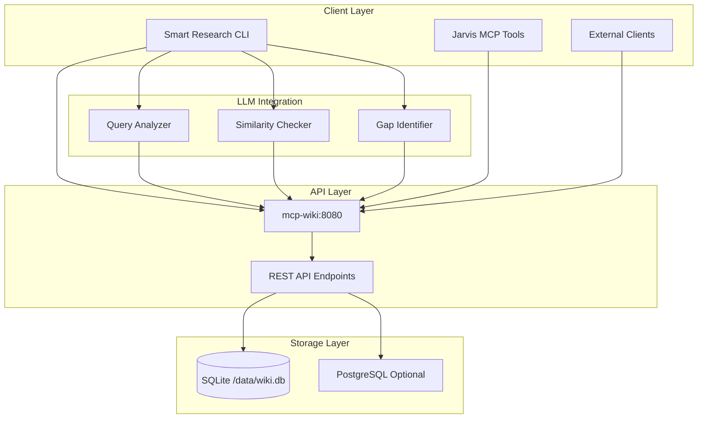
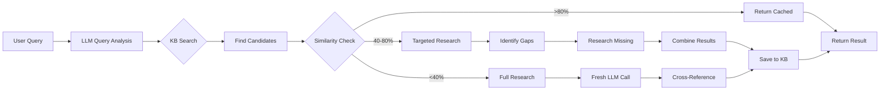
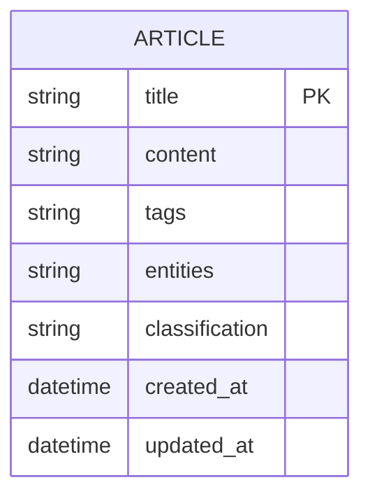
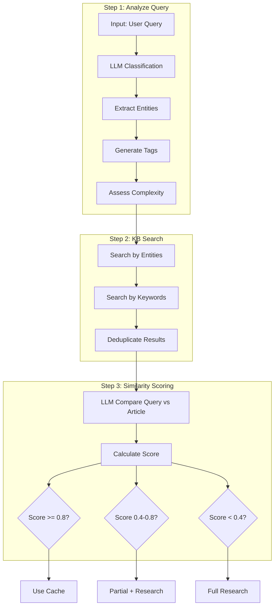
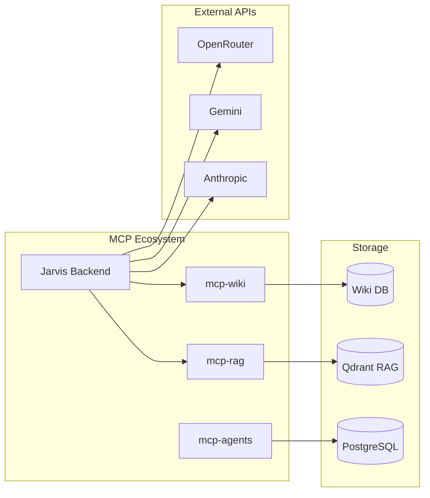

# MCP-Wiki Assessment: LLM-Powered Knowledge Base

## Overview

**mcp-wiki** is an intelligent knowledge base service running in the `idc1-db` stack. It combines traditional wiki storage with LLM-powered query analysis, semantic search, and smart caching to optimize research workflows.

## Architecture



## Smart Research Workflow



## API Endpoints

| Method | Endpoint | Description |
|--------|----------|-------------|
| GET | `/api/search?q={query}&limit={n}` | Search articles by keyword |
| GET | `/api/articles?limit={n}` | List all articles |
| GET | `/api/articles/{title}` | Get specific article |
| POST | `/api/articles` | Create new article |

## Data Schema



## Query Analysis Pipeline



## Configuration

| Environment Variable | Default | Description |
|---------------------|---------|-------------|
| `WIKI_API_URL` | `http://mcp-wiki:8080` | API endpoint |
| `DATABASE_URL` | - | Optional PostgreSQL connection |
| `USE_POSTGRES` | `1` | Enable PostgreSQL backend |
| `OPENROUTER_API_KEY` | - | LLM API key for analysis |

## Docker Compose Stack (idc1-db)

```yaml
services:
  mcp-wiki:
    image: chaban/mcp-wiki:latest
    container_name: mcp-wiki
    ports:
      - "8080:8080"
    volumes:
      - wiki-data:/data
    environment:
      - WIKI_DB_PATH=/data/wiki.db
      - LOG_LEVEL=INFO
    networks:
      - idc1-db-network

volumes:
  wiki-data:
    driver: local
```

## Usage Examples

### CLI Smart Research
```bash
# Research with cache
python smart-research.py "What is Gemini Live API?"

# Force fresh research
python smart-research.py "Compare GPT-4 and Claude" --no-cache

# Use specific model
python smart-research.py "Docker best practices" --model anthropic/claude-3.5-sonnet
```

### Direct API Usage
```python
from smart_research import WikiKnowledgeBase

kb = WikiKnowledgeBase("http://mcp-wiki:8080")

# Search articles
results = kb.search("docker", limit=5)

# Get article
article = kb.get_article("Docker Best Practices")

# Save article
kb.save_article(
    title="New Topic",
    content="Article content...",
    tags=["docker", "devops"],
    entities=["Docker", "Container"],
    classification="tutorial"
)
```

## Smart Caching Strategy

| Similarity | Action | API Calls Saved |
|------------|--------|-----------------|
| >80% | Return cached | 1 LLM call |
| 40-80% | Research gaps only | Partial LLM call |
| <40% | Full research | 0 (fresh) |

## Integration Points



## Key Features

1. **Intelligent Caching**: KB-first approach with LLM-powered similarity detection
2. **Gap-Aware Research**: Only researches missing information, not entire topics
3. **Auto Cross-Referencing**: Links related articles automatically
4. **Dual Backend**: SQLite for simple setups, PostgreSQL for production
5. **MCP Compatible**: Can be exposed as MCP tools for agents

## Performance Characteristics

- **Search Latency**: ~10-50ms (SQLite), ~5-20ms (PostgreSQL)
- **Similarity Check**: ~500-2000ms (depends on LLM)
- **Cache Hit Rate**: Typically 40-60% for repeated queries
- **Storage**: ~1KB per article + metadata

## Future Enhancements

1. Semantic embeddings for vector search
2. Real-time collaboration features
3. MCP tool definitions for direct agent integration
4. Webhook support for article updates
5. Full-text search with ranking

## Deployment

The service is deployed as part of the `idc1-db` stack:

```bash
# Deploy stack
cd stacks/idc1-db
docker-compose up -d mcp-wiki

# Check status
curl http://localhost:8080/api/articles

# View logs
docker logs -f mcp-wiki
```
