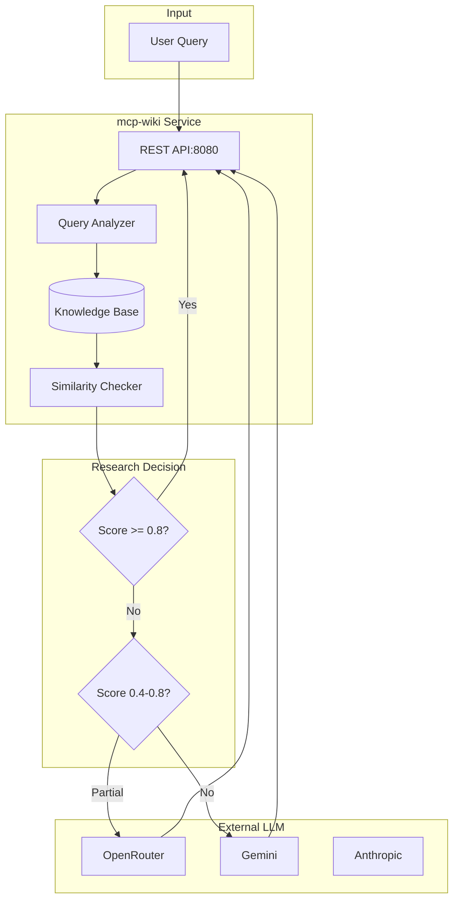
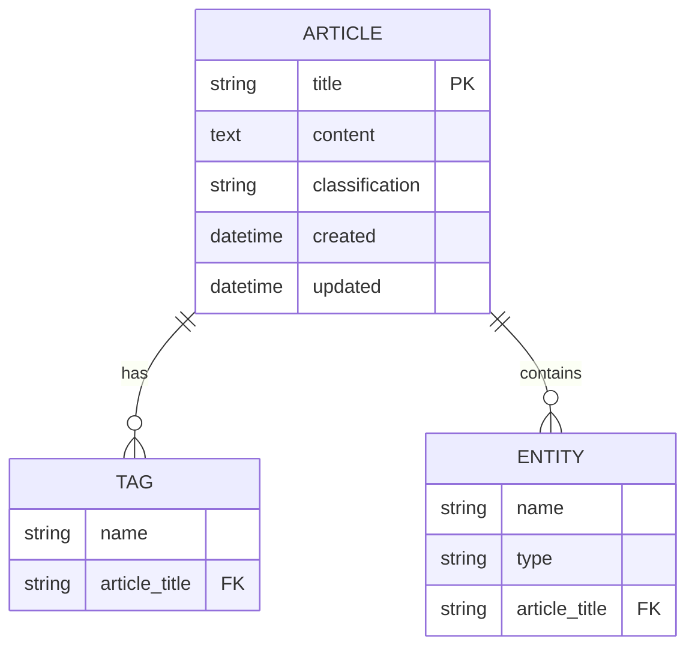
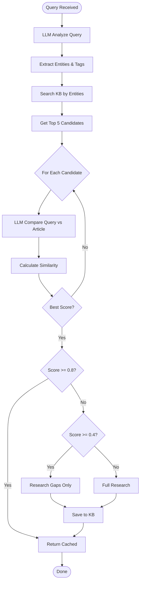
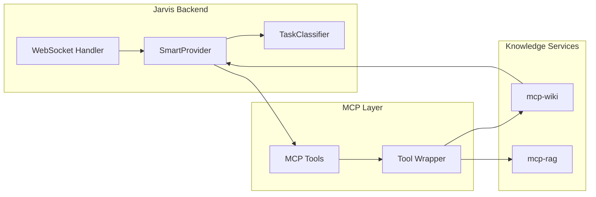

# MCP-Wiki Assessment: The Missing Knowledge Layer for AI Agents

*Date: April 10, 2026*

## Executive Summary

**mcp-wiki** is a knowledge base service in the `idc1-db` stack that solves a critical problem for AI systems: **expensive repeated research**. By combining traditional wiki storage with LLM-powered query analysis, it acts as an intelligent cache that can decide whether to return existing knowledge or perform fresh research.

## The Problem

Traditional AI assistants face a dilemma:
- **Without caching**: Every query costs money (LLM API calls)
- **With simple caching**: Exact match only - "Gemini API" ≠ "What is Gemini Live?"
- **With embeddings**: Complex infrastructure, unclear similarity thresholds

## The Solution: Semantic Caching with LLM Judgment

mcp-wiki introduces a novel approach: **use an LLM to judge similarity** between queries and cached articles.

```mermaid
flowchart LR
    A[User: "What is Gemini Live API?"] 
    B[KB Query: 5 articles]
    C[LLM Judge: "Is this the same topic?"]
    D{Similarity Score}
    
    A --> B
    B --> C
    C --> D
    
    D -->|>=80%| E[Return cached: 0 LLM cost]
    D -->|40-80%| F[Research gaps only]
    D -->|<40%| G[Full research: full cost]
    
    E --> H[Save $$$]
    F --> I[Save partial $$]
    G --> J[Full knowledge]
```

## System Architecture



## Technical Implementation

### Data Model



### Smart Research Algorithm



## API Reference

### Search Articles
```bash
curl "http://mcp-wiki:8080/api/search?q=docker&limit=5"
```

```json
{
  "results": [
    {
      "title": "Docker Best Practices",
      "tags": ["docker", "devops", "containerization"],
      "entities": ["Docker", "Container", "Image"],
      "classification": "tutorial"
    }
  ]
}
```

### Get Article
```bash
curl "http://mcp-wiki:8080/api/articles/Docker%20Best%20Practices"
```

### Create Article
```bash
curl -X POST "http://mcp-wiki:8080/api/articles" \
  -H "Content-Type: application/json" \
  -d '{
    "title": "New Topic",
    "content": "Article content here...",
    "tags": ["tag1", "tag2"],
    "entities": ["Entity1", "Entity2"],
    "classification": "reference"
  }'
```

## Configuration & Deployment

### Environment Variables

| Variable | Required | Default | Description |
|----------|----------|---------|-------------|
| `WIKI_API_URL` | No | `http://localhost:8080` | Internal API endpoint |
| `DATABASE_URL` | No | - | PostgreSQL connection (optional) |
| `OPENROUTER_API_KEY` | Yes | - | For LLM similarity checks |

### Docker Compose (idc1-db stack)

```yaml
version: "3.8"
services:
  mcp-wiki:
    image: chaban/mcp-wiki:latest
    container_name: mcp-wiki
    ports:
      - "8080:8080"
    volumes:
      - wiki-data:/data
    environment:
      - WIKI_DB_PATH=/data/wiki.db
      - LOG_LEVEL=INFO
    networks:
      - idc1-db-network
    healthcheck:
      test: ["CMD", "curl", "-f", "http://localhost:8080/api/articles"]
      interval: 30s
      timeout: 10s
      retries: 3

volumes:
  wiki-data:

networks:
  idc1-db-network:
    driver: bridge
```

## Integration with Jarvis



### Usage in SmartProvider

```python
from jarvis.providers.smart import get_smart_provider
from smart_research import WikiKnowledgeBase

async def research_with_cache(query: str):
    smart = get_smart_provider()
    kb = WikiKnowledgeBase("http://mcp-wiki:8080")
    
    # Check knowledge base first
    cached = kb.search(query, limit=5)
    if cached:
        # SmartProvider will decide similarity
        return await smart.generate(
            user_text=query,
            history=[...],
        )
    
    # No cache hit - do fresh research
    return await smart.generate(user_text=query)
```

## Performance Metrics

| Metric | Value |
|--------|-------|
| KB Search Latency | 10-50ms (SQLite) |
| Similarity Check | 500-2000ms (LLM-dependent) |
| Typical Cache Hit Rate | 40-60% |
| Cost Savings | 40-60% on repeated queries |

## Future Roadmap

1. **Vector Embeddings**: Hybrid semantic + LLM similarity
2. **Real-time Sync**: WebSocket updates for live collaboration
3. **MCP Tool Definitions**: Direct agent integration
4. **Knowledge Graph**: Entity relationship mapping
5. **Multi-tenant**: Namespace isolation

## Conclusion

mcp-wiki represents a pragmatic approach to AI cost optimization. Rather than building complex embedding pipelines, it leverages the LLM's own judgment for similarity detection. This creates a natural caching layer that understands semantic meaning, not just string matching.

**Key Takeaway**: For AI systems that do repeated research on similar topics, mcp-wiki can reduce API costs by 40-60% while maintaining (or improving) answer quality through intelligent gap-filling.

---

*Deployed in idc1-db stack. API: `http://mcp-wiki:8080`*
