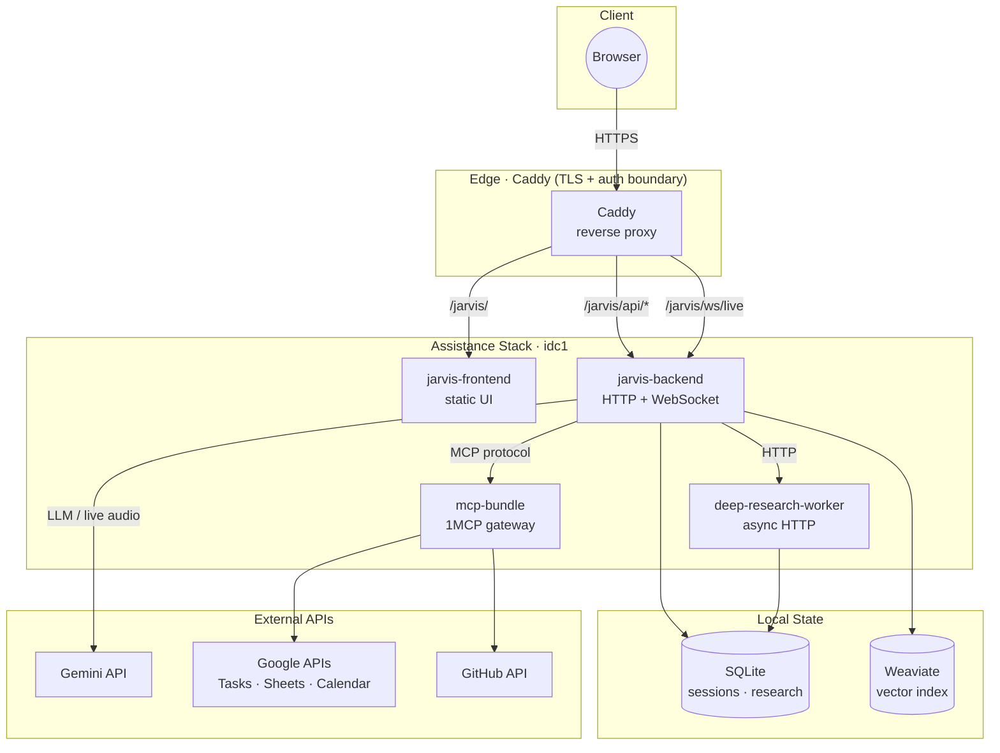

# Jarvis Assistance – Frontend/Backend Overview

Architecture of the **idc1-assistance** stack: browser UI, edge proxy, backend services, local state, and external APIs.

**Legend**

| Node | Description |
|------|-------------|
| Caddy | Edge reverse proxy; terminates TLS and enforces the auth boundary |
| jarvis-frontend | Nginx-served static SPA (port 18080 inside stack) |
| jarvis-backend | Python service; HTTP REST + WebSocket live audio (port 18018) |
| deep-research-worker | Async HTTP worker called by backend (port 8030) |
| mcp-bundle | 1MCP gateway aggregating Google & GitHub MCP servers (port 3050) |
| SQLite | Session store (`JARVIS_SESSION_DB`) + research DB (`DEEP_RESEARCH_DB`) |
| Weaviate | Vector index for retrieval (`WEAVIATE_URL`) |
| Gemini API | Google Gemini – LLM inference and live audio (`GEMINI_API_KEY`) |
| Google APIs | Tasks, Sheets, Calendar via OAuth MCP tools |
| GitHub API | Repository access via `GITHUB_PERSONAL_TOKEN_RO/RW` |
