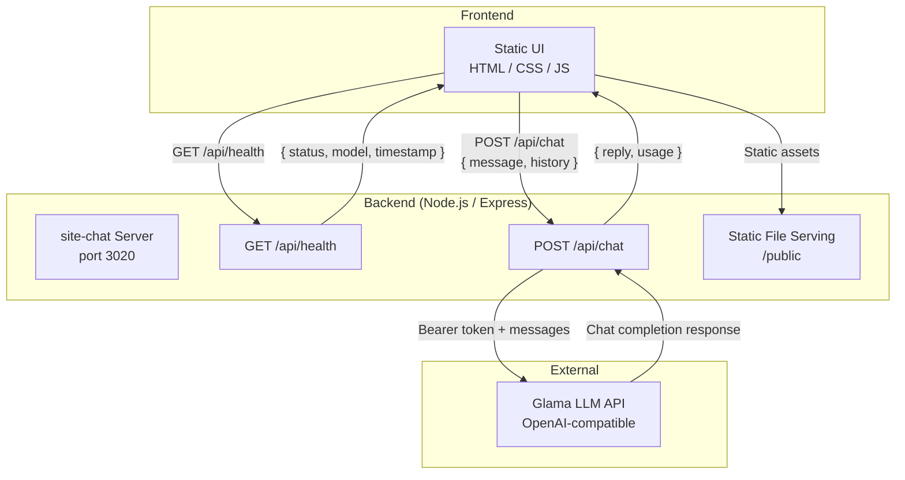

# Chaba Frontend–Backend Architecture

This diagram provides a high-level overview of how the Chaba frontend and backend components interact.

## Component Notes

| Component | Description |
|-----------|-------------|
| **Static UI** | Plain HTML/CSS/JS served from `public/`; sends user messages and conversation history to the backend |
| **site-chat Server** | Express app that validates requests, manages conversation context, and proxies LLM calls |
| **`GET /api/health`** | Returns readiness status and the active model name |
| **`POST /api/chat`** | Accepts a user message + optional history, forwards to Glama, returns the assistant reply |
| **Glama LLM API** | OpenAI-compatible external API used for chat completions; authenticated via `GLAMA_API_KEY` |
