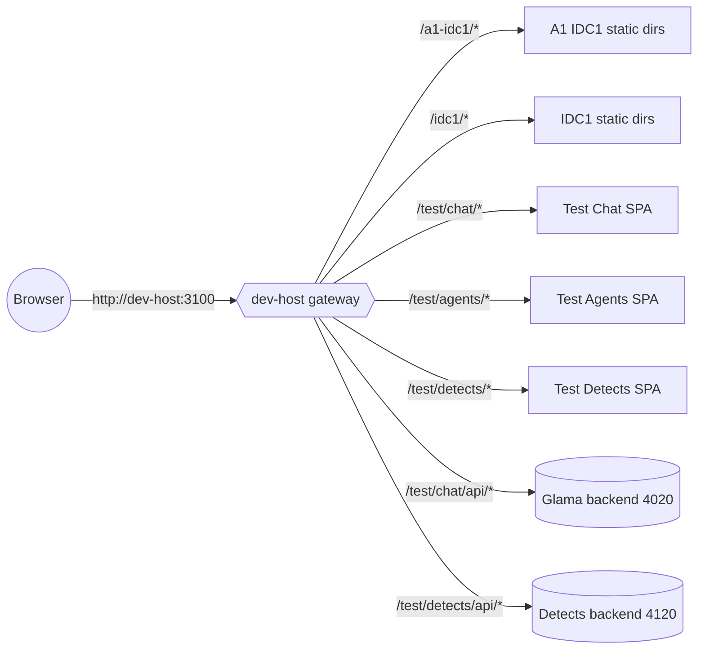
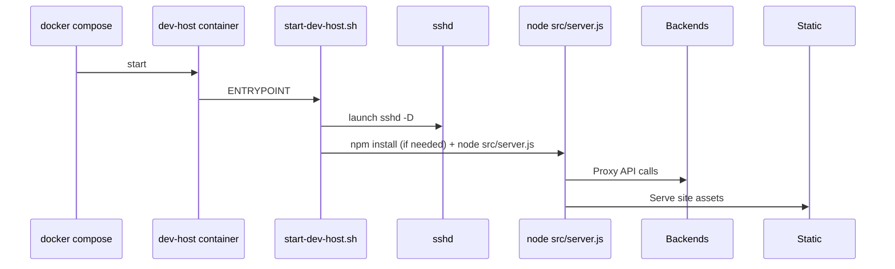

# dev-host environment reference

## Purpose
`dev-host` replaces the old local `node-1` container as the canonical development target. It mirrors the production node in terms of user accounts, SSH access, and mounted workspace, while exposing convenience routes such as `/a1-idc1/*` and `/test/chat/*` from a single container.

## Container structure
- **Location:** `docker/dev-host/`
- **Ports:** `2223:22` for SSH, `3100:3000` for HTTP.
- **Entry point:** `start-dev-host.sh` runs `sshd` plus the gateway server automatically and tails logs to `/tmp/dev-host.log`.
- **Volumes:** `../:/workspace` so all site folders are editable from the host.
- **Bring up:**
  ```
  cmd /c "cd /d c:\chaba\docker && docker compose up -d dev-host"
  ```

## Secrets & env
- Mirror production env files/keys under `.secrets/dev-host/` (same filenames as `.secrets/node-1`).
- Deploy scripts pick these up automatically; no extra configuration is required once the folder exists.

## Gateway routing
The Express gateway lives in `sites/dev-host/src/server.js`. It provides:

| Path | Source | Notes |
| --- | --- | --- |
| `/a1-idc1/*` | `sites/a1-idc1` | Static + SPA fallback. |
| `/idc1/*` | `sites/idc1` | Static + SPA fallback. |
| `/test/chat/*` | `sites/a1-idc1/test/chat` | SPA fallback replicates Caddy `try_files`. |
| `/test/agents/*` | `sites/a1-idc1/test/agents` | SPA fallback. |
| `/test/detects/*` | `sites/a1-idc1/test/detects` | SPA fallback. |

## API proxies
| Route | Target env vars | Default target | Purpose |
| --- | --- | --- | --- |
| `/test/chat/api/*` | `GLAMA_PROXY_TARGET` or `DEV_HOST_GLAMA_TARGET` | `http://host.docker.internal:4020` | Forwards to Glama chat backend. |
| `/test/detects/api/*` | `DETECTS_PROXY_TARGET` or `DEV_HOST_DETECTS_TARGET` | `http://host.docker.internal:4120` | Forwards to detects service. |

Both proxies add `x-dev-host-proxy` headers for easier tracing and rewrite the path to match the backend expectations.

## Health checks
- Container healthcheck: `nc -z localhost 22` (SSH ready).
- Gateway health: `http://dev-host:3100/api/health` summarizes mounted site roots.

## Runbook

### Startup
1. `cmd /c "cd /d c:\chaba\docker && docker compose up -d dev-host"`
2. (Optional) Tail logs: `docker compose logs -f dev-host`
3. Verify health: `Invoke-WebRequest http://127.0.0.1:3100/api/health`

### Switching proxy targets
| Service | Env var | Default |
| --- | --- | --- |
| Glama | `GLAMA_PROXY_TARGET` / `DEV_HOST_GLAMA_TARGET` | `http://host.docker.internal:4020` |
| Detects | `DETECTS_PROXY_TARGET` / `DEV_HOST_DETECTS_TARGET` | `http://host.docker.internal:4120` |

Set in `.env` or export before running compose. Restart container to apply.

### Debugging
1. `docker compose exec dev-host ps -ef` – ensure `node src/server.js` is running.
2. `docker compose exec dev-host cat /tmp/dev-host.log` – gateway log output.
3. `Invoke-WebRequest http://127.0.0.1:3100/test/chat/api/health` – Glama proxy status.
4. `Invoke-WebRequest http://127.0.0.1:3100/test/detects/api/health` – Detects proxy status.
5. If static path 404s, confirm directory presence under `sites/a1-idc1/test/*`.

### Redeploying / rebasing
1. Pull repo changes.
2. `docker compose build dev-host` when Dockerfile/start script changes.
3. `docker compose restart dev-host`.
4. Re-run health checks above.

## Architecture diagrams

### Container and routing flow


### Boot sequence


## Troubleshooting
1. **Container running but site unavailable** – confirm gateway process via `docker compose exec dev-host ps -ef`.
2. **Proxy errors** – check `/tmp/dev-host.log` for `[dev-host] ... proxy error` entries; verify the target service is reachable from the host.
3. **Static path 404s** – ensure the relevant `sites/<name>/test/...` directories exist; gateway falls back to JSON 404 if no root is found.
4. **DNS issues** – add `dev-host` to hosts file (`127.0.0.1 dev-host`) or access via `http://127.0.0.1:3100`.
