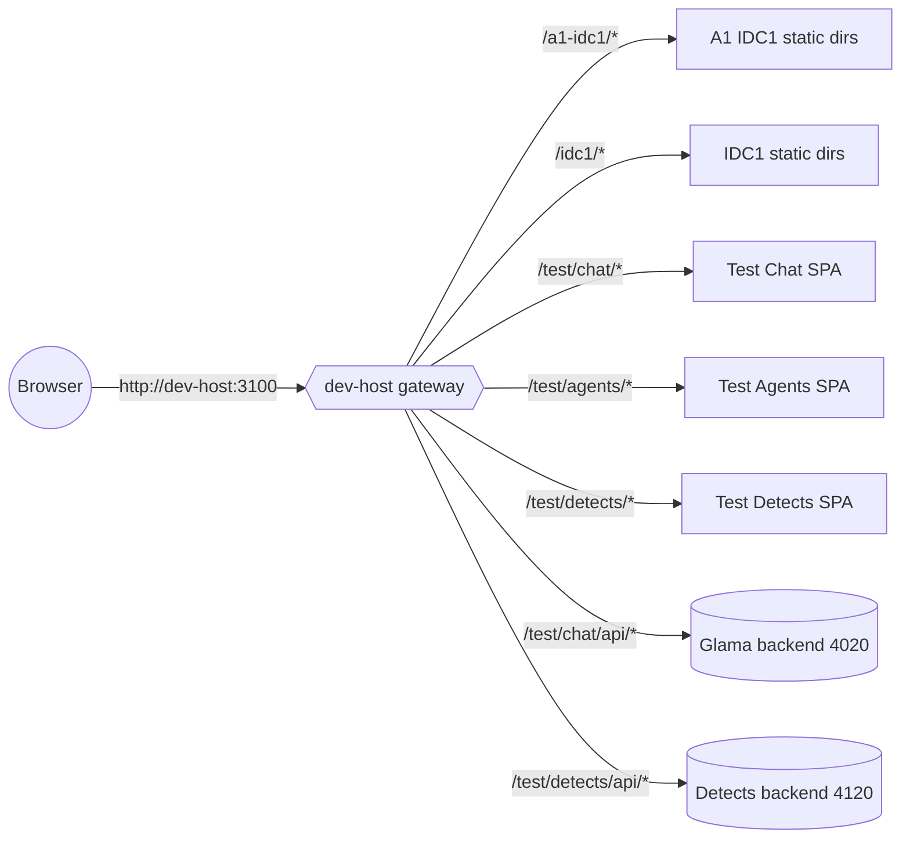
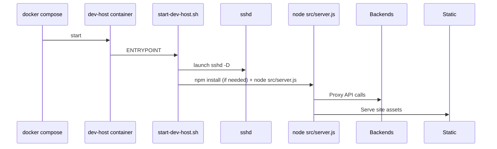

# dev-host environment reference

## Purpose
`dev-host` replaces the old local `node-1` container as the canonical development target. It mirrors the production node in terms of user accounts, SSH access, and mounted workspace, while exposing convenience routes such as `/a1-idc1/*` and `/test/chat/*` from a single container.

## Container structure
- **Location:** `docker/dev-host/`
- **Ports:** `2223:22` for SSH, `3100:3000` for HTTP.
- **Entry point:** `start-dev-host.sh` runs `sshd` plus the gateway server automatically and tails logs to `/tmp/dev-host.log`.
- **Volumes:** `../:/workspace` so all site folders are editable from the host.
- **Bring up:**
  ```
  cmd /c "cd /d c:\chaba\docker && docker compose up -d dev-host"
  ```

> **pc2 note:** pc2 now follows the single-ingress pattern (like idc1): `pc2-host-caddy` owns `:80/:443` and routes by hostname. Keep dev-host on `DEV_HOST_HTTP_PORT=3100` and access it via:
> - `https://dev-host.pc2.vpn/`
> - `https://test.pc2.vpn/test/`

## Secrets & env
- Mirror production env files/keys under `.secrets/dev-host/` (same filenames as `.secrets/node-1`).
- Deploy scripts pick these up automatically; no extra configuration is required once the folder exists.
- **Publish token:** create `.secrets/dev-host/publish.token` containing the shared secret used by the gateway’s `/api/deploy/*` endpoints. `start-dev-host.sh` automatically exports it as `DEV_HOST_PUBLISH_TOKEN` so the UI publish buttons work. Restart the container after editing the token.
- **Local profiles:** `sites/dev-host/.env.dev-host.example` ships with sane defaults for every proxy target (Glama, Detects, Agents, etc.). Copy it to `.env.dev-host` to override endpoints per workstation without touching Docker secrets. The server auto-loads `.env.dev-host` (falling back to `.env`) on startup.
- **Env discovery order:** `server.js` now searches, in order, for `.env.dev-host` and `.env` inside `sites/dev-host/`, `sites/dev-host/..` (workspace root), and the repo root. The first file found is loaded via `dotenv` and logged as `[dev-host] Loaded environment from …`, so you always know which file is active.

## Gateway routing
The Express gateway lives in `sites/dev-host/src/server.js`. It provides:

| Path | Source | Notes |
| --- | --- | --- |
| `/a1-idc1/*` | `sites/a1-idc1` | Static + SPA fallback. |
| `/idc1/*` | `sites/idc1` | Static + SPA fallback. |
| `/test/chat/*` | `sites/a1-idc1/test/chat` | SPA fallback replicates Caddy `try_files`. |
| `/test/agents/*` | `sites/a1-idc1/test/agents` | SPA fallback. |
| `/test/detects/*` | `sites/a1-idc1/test/detects` | SPA fallback. |
| `/test/imagen/*` | `sites/a1-idc1/test/imagen` | Static preview wired to Imagen MCP service. |

### Local gateway workflow
1. `cd sites/dev-host && npm install` (once).
2. `npm run dev` starts the gateway with `nodemon`, so any changes under `sites/dev-host/src` hot-reload automatically.
3. Copy or edit `.env.dev-host` whenever you need to flip proxy targets (e.g., point Detects at `http://localhost:4120`). Nodemon picks up env edits on the next restart; stop/start the dev task if you tweak proxies mid-session.
4. Hit `http://127.0.0.1:3000/` (or whatever `DEV_HOST_BASE_URL` you set) to test routing and diagnostics outside Docker.

## API proxies
| Route | Target env vars | Default target | Purpose |
| --- | --- | --- | --- |
| `/test/chat/api/*` | `GLAMA_PROXY_TARGET` or `DEV_HOST_GLAMA_TARGET` | `http://host.docker.internal:4020` | Forwards to Glama chat backend. |
| `/test/detects/api/*` | `DETECTS_PROXY_TARGET` or `DEV_HOST_DETECTS_TARGET` | `http://host.docker.internal:4120` | Forwards to detects service. |
| `/test/agents/api/*` | `AGENTS_PROXY_TARGET` or `DEV_HOST_AGENTS_TARGET` | `http://127.0.0.1:4060` | Internal Agents API / observability surface. |
| `/test/mcp0/*` | `MCP0_PROXY_TARGET` or `DEV_HOST_MCP0_TARGET` | `http://host.docker.internal:8351` | MCP0 admin/API passthrough. |
| `/test/imagen/api/*` | `ONE_MCP_BASE_URL`, `ONE_MCP_APP`, `IMAGEN_MCP_TOOL_NAME` | `http://1mcp.pc1.vpn:3052` | Imagen generation via 1mcp tool invocation. |

> **Canonical preview URL:** On pc1 the gateway is always available at `http://dev-host.pc1/test/`. Use that host when sharing preview links (e.g., `http://dev-host.pc1/test/detects/`, `http://dev-host.pc1/test/agents/`, `http://dev-host.pc1/test/agens/`).

Both proxies add `x-dev-host-proxy` headers for easier tracing and rewrite the path to match the backend expectations.

## Proxy smoke tests & `/api/health`

- `GET /api/health` now aggregates downstream proxy checks (`glama`, `agents`, `detects`, `mcp0`, `1mcp`) in addition to static site presence.
- Each proxy report contains `{ status, httpStatus, latencyMs, body }`. A status of `error` paired with an `HTTP xxx` entry means the gateway could reach the backend but it returned an error; `error` with `ECONNREFUSED` indicates the service is down or mis-pointed.
- Run `Invoke-WebRequest http://127.0.0.1:3100/api/health | ConvertFrom-Json` locally or from pc1/pc2 to confirm the aggregate payload after every deploy.
- Individual smoke checks:  \
 `Invoke-WebRequest http://127.0.0.1:3100/test/imagen/api/health` (Imagen),  \
 etc. These endpoints surface the backend `/health` responses verbatim.

### Remote exposure (pc2 worker)

On pc2, remote access is expected to go through `pc2-host-caddy` on `:443` using the VPN wildcard hostnames:
1. `https://dev-host.pc2.vpn/` (dev-host gateway)
2. `https://test.pc2.vpn/test/` (test landing)
3. `https://1mcp.pc2.vpn/health/ready` (1mcp-agent)

`DEV_HOST_HTTP_PORT=3100` remains the host port for the dev-host container, but it is an internal upstream for Caddy and not meant to be exposed directly as an HTTPS entrypoint.

Bake these checks into incident runbooks so UI operators can quickly diagnose proxy issues.

## Health checks
- Container healthcheck: `nc -z localhost 22` (SSH ready).
- Gateway: `GET /api/health` now aggregates downstream proxy health in addition to mounted site roots. Each target (Glama, Agents, Detects, MCP0, 1mcp) reports `status`, HTTP code, latency, and the parsed `/health` body so you can see exactly which dependency is broken.
- The JSON payload includes `overall status` (`ok` vs. `degraded`), `proxies[]`, and `sites[]` booleans indicating whether each static root exists inside the container/workspace.

## Runbook

### Startup
1. `cmd /c "cd /d c:\chaba\docker && docker compose up -d dev-host"`
2. (Optional) Tail logs: `docker compose logs -f dev-host`
3. Verify health: `Invoke-WebRequest http://127.0.0.1:3100/api/health`

### Switching proxy targets
| Service | Env var | Default |
| --- | --- | --- |
| Glama | `GLAMA_PROXY_TARGET` / `DEV_HOST_GLAMA_TARGET` | `http://host.docker.internal:4020` |
| Detects | `DETECTS_PROXY_TARGET` / `DEV_HOST_DETECTS_TARGET` | `http://host.docker.internal:4120` |

Set in `.env` or export before running compose. Restart container to apply.

### Debugging
1. `docker compose exec dev-host ps -ef` – ensure `node src/server.js` is running.
2. `docker compose exec dev-host cat /tmp/dev-host.log` – gateway log output.
3. `Invoke-WebRequest http://127.0.0.1:3100/test/chat/api/health` – Glama proxy status.
4. `Invoke-WebRequest http://127.0.0.1:3100/test/detects/api/health` – Detects proxy status.
5. If static path 404s, confirm directory presence under `sites/a1-idc1/test/*`.

### Troubleshooting matrix

| Symptom | Likely cause | How to confirm | Fix |
| --- | --- | --- | --- |
| `/api/health` reports `status: degraded` and a proxy entry shows `status: error` | Downstream service not running or wrong target URL | Inspect that proxy’s `target` + `httpStatus` fields in `/api/health` and hit the target `/health` directly | Start the missing service (PM2/systemd/Docker) or update `.env.dev-host` to the correct target, then restart `npm run dev` |
| All `proxies[]` show `status: unconfigured` | `.env.dev-host` missing or variables empty | Check server logs for `[dev-host] Loaded environment…`; inspect `/api/health` payload | Copy `.env.dev-host.example` → `.env.dev-host`, set targets, restart dev-host |
| `/test/detects/*` returns 502/504 via dev-host | Detects API down or proxy mis-pointed | `Invoke-WebRequest http://127.0.0.1:3100/test/detects/api/health`; check PM2 (`pm2 list`) | Restart detects API (PM2/systemd) or fix `DETECTS_PROXY_TARGET` |
| Static route (e.g., `/a1-idc1/test/detects/`) returns 404 | Workspace folder missing/mis-synced | `/api/health` `sites[]` entry shows `rootExists: false` | Ensure repo is mounted/synced in `sites/<slug>`; rerun deploy or git pull |
| `ssh chaba@dev-host` succeeds but UI buttons fail to publish | Missing or stale `.secrets/dev-host/publish.token` | `/api/health` still ok; `/api/deploy/*` responds 401 | Regenerate token, place in `.secrets/dev-host/publish.token`, restart container |
| `ssh <user>@dev-host` fails with `Permission denied` or `Connection reset` | Wrong user/key, SSH service down, or security group blocking | Try `ssh -vvv <user>@dev-host`; check `docker compose logs dev-host` for `sshd` errors | Confirm correct username (`chaba`), ensure private key matches `authorized_keys`, restart container if sshd crashed; verify host firewall allows port 22/2223 |
| `ssh chaba@pc2` works but gateway routes still break | Remote worker reachable but services not running | After login run `pm2 list`/`docker ps` on pc2; check `/api/health` from that host | Start the missing PM2 apps or docker stack on pc2, then re-hit dev-host proxies |

## Runbook

### Startup
1. `cmd /c "cd /d c:\chaba\docker && docker compose up -d dev-host"`
2. `docker compose build dev-host` when Dockerfile/start script changes.
3. `docker compose restart dev-host`.
4. Re-run health checks above.

## Architecture diagrams

### Container and routing flow


### Boot sequence


## Troubleshooting
1. **Container running but site unavailable** – confirm gateway process via `docker compose exec dev-host ps -ef`.
2. **Proxy errors** – check `/tmp/dev-host.log` for `[dev-host] ... proxy error` entries; verify the target service is reachable from the host.
3. **Static path 404s** – ensure the relevant `sites/<name>/test/...` directories exist; gateway falls back to JSON 404 if no root is found.
4. **DNS issues** – add `dev-host` to hosts file (`127.0.0.1 dev-host`) or access via `http://127.0.0.1:3100`.
5. **Static path 404s** – ensure the relevant `sites/<name>/test/...` directories exist; gateway falls back to JSON 404 if no root is found.
6. **DNS issues** – add `dev-host` to hosts file (`127.0.0.1 dev-host`) or access via `http://127.0.0.1:3100`.

## Remote development on idc1 (code-server)
With the idc1 stack upgrade we can now edit the repo directly on that host via VS Code Web (code-server). This keeps changes in the same filesystem that powers the MCP services and deploy scripts.

### Configure code-server
1. Copy `stacks/idc1-stack/.env.example` → `.env` (kept outside git) if you have not already.
2. Add/update these entries (example values):
   ```
   CODE_SERVER_PORT=8443
   CODE_SERVER_PASSWORD=<strong passphrase>
   CODE_SERVER_WORKSPACE=/workspaces/chaba
   CODE_SERVER_UID=1000
   CODE_SERVER_GID=1000
   ```
   - Prefer `CODE_SERVER_HASHED_PASSWORD` (argon2) if sharing access broadly.
   - Choosing 1000/1000 keeps file ownership aligned with the existing repo volume.

### Bring code-server online
1. From `c:\chaba\stacks\idc1-stack`, run:
   ```
   cmd /c "cd /d c:\chaba\stacks\idc1-stack && docker compose --profile mcp-suite up -d code-server"
   ```
   (Use `up -d` without `code-server` to launch the whole stack.)
2. Tail logs and verify health:
   ```
   cmd /c "cd /d c:\chaba\stacks\idc1-stack && docker compose logs -f code-server"
   ```
   Wait for `http://localhost:8080/healthz` OK messages.

### Secure exposure
1. On idc1, allow the port through the firewall (`New-NetFirewallRule -DisplayName "IDC1 Code Server" -Direction Inbound -Protocol TCP -LocalPort 8443 -Action Allow`).
2. Prefer encrypted access:
   - **SSH tunnel:** `ssh -L 8443:127.0.0.1:8080 tonezzz@idc1.surf-thailand.com`.
   - **Reverse proxy:** terminate HTTPS via Caddy/NGINX with HTTP Basic Auth before forwarding to `code-server`.
3. Rotate the password whenever staff change; keep it in the internal secrets manager rather than the repo.

### Daily usage
1. Visit `https://<idc1-host>:8443/`, enter the password, and open `/workspaces/chaba`.
2. Terminal tabs run inside the container, so `npm run build`, `docker compose`, etc., operate directly on idc1.
3. Coordinate git branches when multiple people share the workspace (consider per-user worktrees under `/workspaces/chaba/users/<name>`).

### Shutdown / updates
- `docker compose stop code-server` to pause the service.
- `docker compose pull code-server && docker compose up -d code-server` to upgrade to a newer image (update `CODE_SERVER_IMAGE_TAG` if pinned).
- After editing `.env`, rerun `docker compose up -d code-server` so the container picks up new settings.
