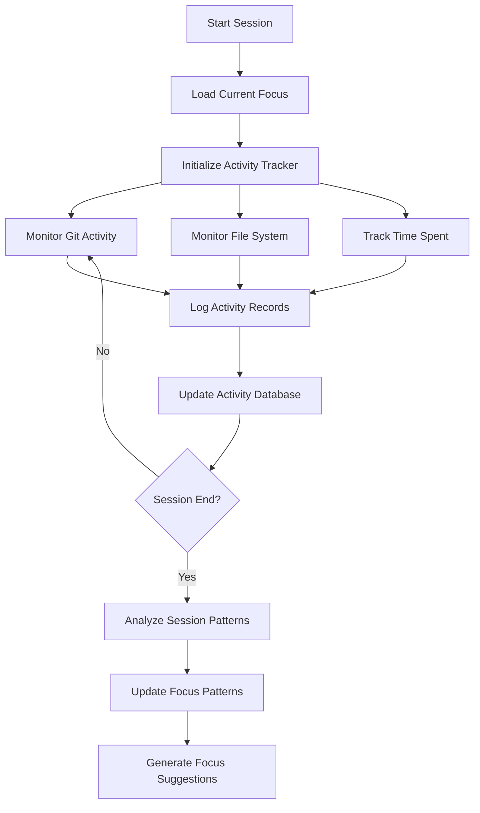
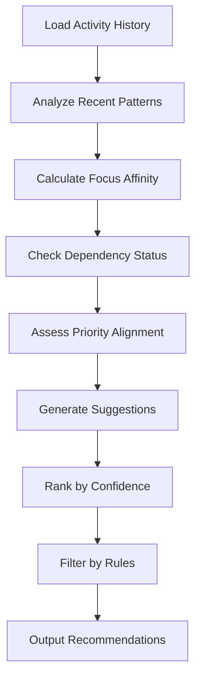
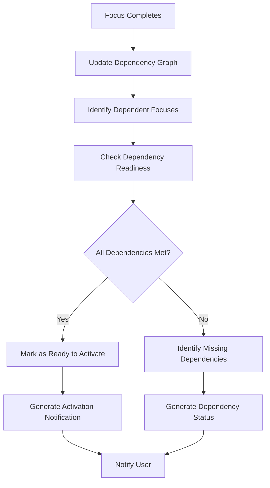
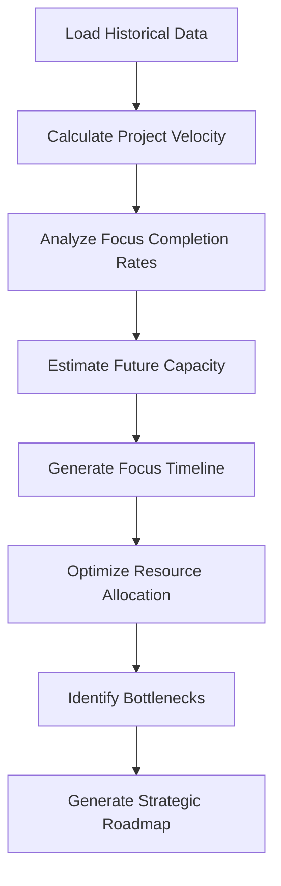

# Strategic Focus Automation System

## Overview
Advanced activity monitoring and dependency-driven automation for strategic focus management across multiple projects and branches.

## Architecture

### Core Components

1. **Activity Tracker** (`scripts/focus-automation/activity-tracker.mjs`)
   - Git commit monitoring per branch
   - File system change detection
   - Time-based activity logging
   - Session context tracking

2. **Activity Database** (`data/focus-activity.json`)
   - Activity history storage
   - Pattern analysis data
   - Focus transition logs
   - Project velocity metrics

3. **Pattern Analysis Engine** (`scripts/focus-automation/pattern-analyzer.mjs`)
   - Activity pattern recognition
   - Focus affinity detection
   - Anomaly detection
   - Trend analysis

4. **Focus Suggestion Engine** (`scripts/focus-automation/focus-suggester.mjs`)
   - Activity-based focus recommendations
   - Dependency-aware suggestions
   - Priority-based ranking
   - Context-aware filtering

5. **Dependency Resolver** (`scripts/focus-automation/dependency-resolver.mjs`)
   - Focus dependency graph management
   - Circular dependency detection
   - Activation sequence planning
   - Dependency completion tracking

6. **Predictive Planner** (`scripts/focus-automation/predictive-planner.mjs`)
   - Project velocity calculation
   - Focus completion estimation
   - Resource allocation optimization
   - Strategic roadmap generation

7. **Notification System** (`scripts/focus-automation/notifier.mjs`)
   - Focus transition alerts
   - Dependency completion notifications
   - Activity pattern summaries
   - Recommendation delivery

8. **SSOT Integration** (`scripts/focus-automation/ssot-integrator.mjs`)
   - SSOT focus file updates
   - Validation integration
   - Status synchronization
   - History management

## Data Structures

### Activity Record
```javascript
{
  timestamp: ISO8601,
  project: string,        // chaba, trade, tony-omen, etc.
  branch: string,         // master, chaba.h3, etc.
  focus_area: string,     // Current strategic focus
  activity_type: enum,    // git_commit, file_change, session_start, session_end
  details: {
    files_changed: [string],
    commit_message: string,
    duration_minutes: number,
    impact_score: number  // 1-10
  },
  metadata: {
    session_id: string,
    user_context: string
  }
}
```

### Focus Pattern
```javascript
{
  focus_name: string,
  activity_affinity: {
    project: string,
    branch: string,
    score: number  // 0-1, how strongly activity correlates with focus
  },
  temporal_patterns: {
    peak_hours: [number],     // Hours when focus is most active
    day_of_week: [number],    // Days when focus is most active
    session_duration: {
      avg: number,
      min: number,
      max: number
    }
  },
  dependency_signals: {
    blocks: [string],        // Focuses that depend on this one
    blocked_by: [string],    // Focuses this one depends on
    readiness_score: number  // 0-1, how ready dependencies are
  }
}
```

### Focus Suggestion
```javascript
{
  suggested_focus: string,
  confidence: number,       // 0-1
  reasons: [string],
  activity_evidence: {
    recent_commits: number,
    file_changes: number,
    time_in_directory: number
  },
  dependency_status: {
    ready: boolean,
    missing_dependencies: [string],
    blocking_focuses: [string]
  },
  priority_alignment: number,  // 0-1, alignment with strategic priorities
  estimated_value: number     // Expected business value
}
```

### Dependency Graph
```javascript
{
  nodes: {
    focus_name: {
      status: enum,           // pending, active, completed, blocked
      priority: enum,          // high, medium, low
      dependencies: [string],
      dependents: [string],
      completion_estimate: ISO8601,
      resource_requirements: {
        time_estimate: string,
        skill_requirements: [string]
      }
    }
  },
  edges: [
    {
      from: string,           // focus name
      to: string,             // focus name
      type: enum,             // hard, soft
      reason: string
    }
  ],
  critical_path: [string],    // Focuses on critical delivery path
  parallelizable: [[string]] // Groups of focuses that can run in parallel
}
```

## Workflow

### 1. Activity Tracking Loop


### 2. Focus Suggestion Process


### 3. Dependency-Driven Activation


### 4. Predictive Planning


## Integration Points

### SSOT Focus Integration
- Read current focus status from `docs/ssot/ssot.focus.yml`
- Update focus status based on activity patterns
- Validate focus transitions before applying
- Maintain focus history in SSOT

### Git Integration
- Hook into git commit process for activity tracking
- Analyze commit messages for focus context
- Track branch switching patterns
- Monitor merge activity

### Session Integration
- Track session start/end times
- Log session context and goals
- Measure session effectiveness
- Correlate sessions with focus outcomes

## Configuration

### Activity Thresholds
```javascript
{
  activity_tracking: {
    commit_window: "24h",           // Time window for commit analysis
    file_change_threshold: 5,       // Min files changed to count as activity
    session_min_duration: 15,       // Min session duration (minutes)
    activity_decay_days: 7          // Days before activity data decays
  },
  focus_suggestions: {
    min_confidence: 0.6,           // Min confidence to suggest focus
    max_suggestions: 3,             // Max suggestions to provide
    suggestion_frequency: "daily"   // How often to generate suggestions
  },
  dependency_management: {
    auto_activate: false,           // Auto-activate ready focuses
    notification_delay: "1h",        // Delay before dependency notifications
    parallel_activation: true       // Allow parallel focus activation
  }
}
```

## Commands

### Activity Tracking
```bash
# Start activity tracking for current session
node scripts/focus-automation/activity-tracker.mjs start

# Stop activity tracking and analyze session
node scripts/focus-automation/activity-tracker.mjs stop

# View recent activity patterns
node scripts/focus-automation/activity-tracker.mjs status
```

### Focus Suggestions
```bash
# Generate focus suggestions based on recent activity
node scripts/focus-automation/focus-suggester.mjs generate

# View focus affinity scores
node scripts/focus-automation/focus-suggester.mjs affinity

# Analyze focus transition patterns
node scripts/focus-automation/focus-suggester.mjs patterns
```

### Dependency Management
```bash
# Check dependency status for all focuses
node scripts/focus-automation/dependency-resolver.mjs status

# Find next activatable focuses
node scripts/focus-automation/dependency-resolver.mjs next

# Visualize dependency graph
node scripts/focus-automation/dependency-resolver.mjs graph
```

### Predictive Planning
```bash
# Generate predictive focus timeline
node scripts/focus-automation/predictive-planner.mjs timeline

# Calculate project velocity metrics
node scripts/focus-automation/predictive-planner.mjs velocity

# Identify potential bottlenecks
node scripts/focus-automation/predictive-planner.mjs bottlenecks
```

## Implementation Phases

### Phase 1: Core Activity Tracking
- Activity tracker implementation
- Activity database structure
- Basic pattern recognition
- SSOT integration

### Phase 2: Focus Suggestions
- Focus suggestion engine
- Dependency awareness
- Priority alignment
- Notification system

### Phase 3: Dependency Automation
- Dependency resolver
- Auto-activation logic
- Dependency notifications
- Critical path analysis

### Phase 4: Predictive Planning
- Velocity calculation
- Predictive modeling
- Resource optimization
- Strategic roadmap generation

## Success Metrics

- **Focus Alignment**: % of time spent on active strategic focuses
- **Prediction Accuracy**: % of focus suggestions that are accepted
- **Dependency Efficiency**: Reduction in dependency-related delays
- **Strategic Velocity**: Increase in strategic focus completion rate
- **Context Switching**: Reduction in focus switching frequency

## Maintenance

- Weekly activity database cleanup
- Monthly pattern model retraining
- Quarterly dependency graph validation
- Annual strategic focus review
