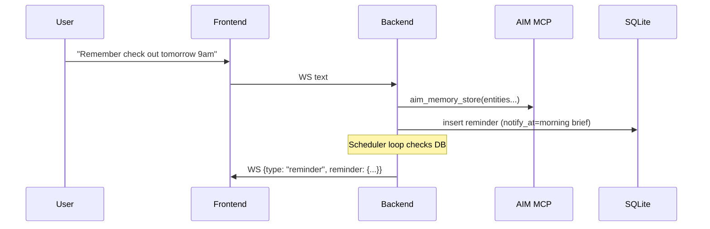

# Assistance Services (Concept)

## Purpose
The `/services/assistance/` tree is the source-of-truth for all *Assistance* application code that is deployed via the `idc1-assistance` stack (Jarvis, TRIP, MCP servers, and any future assistance services).

This policy exists to:
- Keep application code separate from deployment configuration.
- Standardize paths for CI builds (GHCR) and Portainer deploys.
- Make it easy to add new services (e.g. `mcp-*`) without ambiguity.

## High-level layout
```
/services/assistance/
  jarvis-backend/
  jarvis-frontend/
  trip/
  mcp-servers/
```

```mermaid
flowchart LR
  U[User] <-->|WebSocket audio/text| FE[Jarvis Frontend]
  FE -->|WS /ws/live| BE[Jarvis Backend]

  BE -->|tools/call| MCP[mcp-bundle :3050]
  BE -->|tools/call| AIM[aim-mcp-gateway :3050]

  BE -->|writes| DB[(jarvis_sessions.sqlite)]
  DB -->|due reminders| BE
  BE -->|{type: reminder}| FE
```



## Service docs
- `jarvis-backend/ARCHITECTURE.md`
- `jarvis-frontend/ARCHITECTURE.md`
- `trip/ARCHITECTURE.md`
- `mcp-servers/ARCHITECTURE.md`

## Deployment configuration policy
Deployment configuration lives under:
- `/stacks/idc1-assistance/` (Portainer stack)

Rules:
- `/stacks/idc1-assistance/` should contain deployment artifacts only (compose, env examples, notes).
- Application source code must not be placed in `/stacks/`.

## CI/CD + build contexts
Images are built and pushed to GHCR and then pulled by Portainer.

Rules:
- Build contexts in GitHub Actions must reference folders under `/services/assistance/*`.
- Image naming remains stable (e.g. `jarvis-backend`, `jarvis-frontend`), and tags follow the branch.

## Persistence conventions
- Anything that must survive container restarts must live on a named volume or bind mount.

## Safety / guardrails
- Any write to external systems (including TRIP writes: POST/PUT/PATCH/DELETE) must be gated behind explicit user confirmation.
- The backend must support a two-phase flow:
  - **Propose**: create a `pending_action` (no write)
  - **Commit**: execute only when given a valid `confirmation_id`

## Source-of-truth
If there is a mismatch between stack configuration and service folders, the service folders under `/services/assistance/` are considered authoritative, and the stack config should be updated to match.
