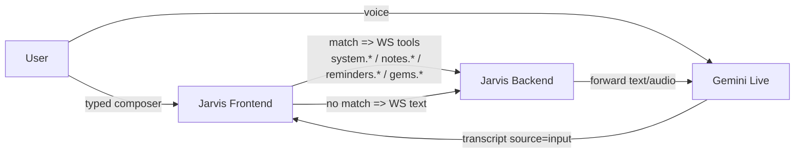
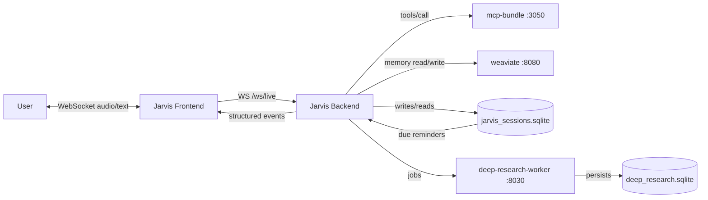
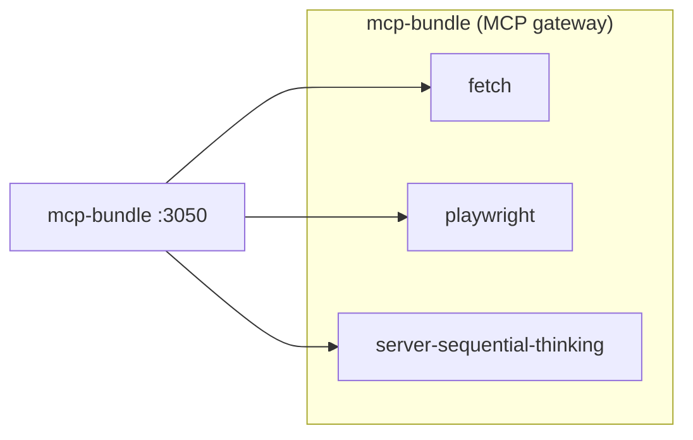
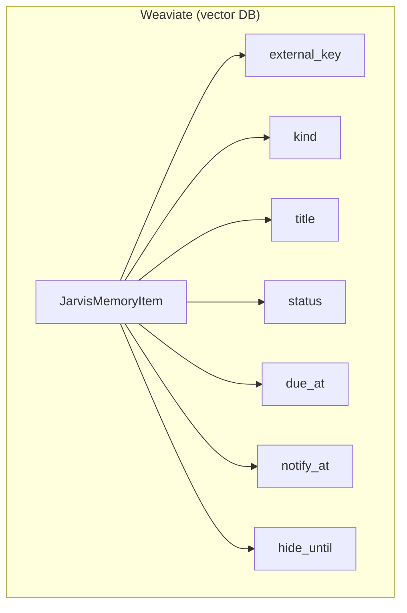
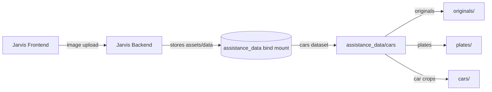
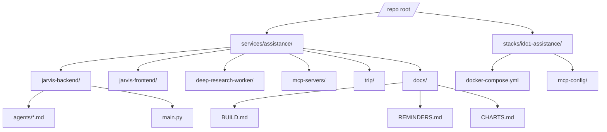

# Charts

These diagrams are the architecture blueprint for the `services/assistance` stack. Keep them accurate and update them whenever service boundaries, ports, endpoints, or persistence rules change.

## 0) Google Sheets SSoT (sys/memory/knowledge/notes/gems)

```mermaid
flowchart LR
  U[User]
  FE[Jarvis Frontend]
  BE[Jarvis Backend]
  MCP[mcp-bundle :3050]

  subgraph GSS[Google Sheets (Authoritative SSoT)]
    SYS[sys\n(key/value/enabled/scope/priority)]
    MEM[memory\n(key/value/enabled/scope/priority)]
    KNOW[knowledge\n(key/value/enabled/scope/priority)]
    NOTES[notes.0\n(id/date_time/subject/notes/status/time)]
    GEMS[gems\n(id/name/purpose/persona/model/...) ]
  end

  subgraph BEState[Backend state (derived + cached)]
    SYSKV[ws.state.sys_kv]
    MEMITEMS[ws.state.memory_items]
    KNOWITEMS[ws.state.knowledge_items]
    MEMCTX[memory_context_text\n(injected to Gemini)]
    KNOWCTX[knowledge_context_text\n(injected to Gemini)]
    GEMCACHE[gems cache\n(sheet-driven gem selection)]
  end

  U <-->|WebSocket audio/text| FE
  FE -->|/ws/live| BE

  BE -->|tools/call| MCP
  MCP -->|values_get| SYS
  MCP -->|values_get| MEM
  MCP -->|values_get| KNOW
  MCP -->|values_append / values_update| NOTES
  MCP -->|values_get| GEMS

  SYS -->|pointers: notes_ss/notes_sh, memory.sheet_name, knowledge.sheet_name, gems_*| BE
  BE --> SYSKV
  BE --> MEMITEMS
  BE --> KNOWITEMS
  MEMITEMS --> MEMCTX
  KNOWITEMS --> KNOWCTX
  GEMS --> GEMCACHE

  KNOWITEMS -.->|dedupe by key| MEMITEMS
```

## 6.6) Deterministic WS tools (per-tool charts)

These are the Mode B control-plane tools that are handled purely by the backend and never forwarded to Gemini.

### 6.6.1) system.reload

```mermaid
flowchart LR
  FE[Jarvis Frontend] -->|{"type":"system","action":"reload","mode":...}| BE[Jarvis Backend]
  BE -->|text/progress| FE
  BE -->|error(kind=invalid_reload_mode/reload_failed)| FE
```

### 6.6.2) notes.*

```mermaid
flowchart LR
  FE[Jarvis Frontend] -->|{"type":"notes","action":"check"}| BE[Jarvis Backend]
  BE -->|text summary + Next:| FE
  FE -->|{"type":"notes","action":"next"}| BE
  BE -->|text next-step line| FE
  FE -->|{"type":"notes","action":"add","text":"..."}| BE
  BE -->|note_created / note_prompt| FE
```

### 6.6.3) reminders.*

```mermaid
flowchart LR
  FE[Jarvis Frontend] -->|{"type":"reminders","action":"add","text":"..."}| BE[Jarvis Backend]
  BE -->|planning_item_created| FE
  FE -->|reminders.list/done/delete/later/reschedule/details| BE
  BE -->|reminders_* events / reminder_detail| FE
  BE -->|error(kind=invalid_reminders_action/...)| FE
```

### 6.6.4) gems.*

```mermaid
flowchart LR
  FE[Jarvis Frontend] -->|{"type":"gems","action":"list"}| BE[Jarvis Backend]
  BE -->|gems_list| FE
  FE -->|{"type":"gems","action":"upsert","gem":{...}}| BE
  BE -->|gems_upserted| FE
  FE -->|{"type":"gems","action":"remove","gem_id":"..."}| BE
  BE -->|gems_removed| FE

  FE -->|{"type":"gems","action":"analyze","gem_id":"...","criteria":"..."}| BE
  BE -->|gems_draft_created (draft_id, before/after, changed)| FE
  FE -->|{"type":"gems","action":"draft_apply","draft_id":"..."}| BE
  BE -->|gems_draft_applied| FE
  FE -->|{"type":"gems","action":"draft_discard","draft_id":"..."}| BE
  BE -->|gems_draft_discarded| FE
```

## 6.5) Frontend smart mapping (typed + voice)



## 1) System overview



## 2) MCP bundle (gateway)



## 3) Weaviate reminder fields



## 4) Cars (planned)



## 5) Reminders (authoritative store + cache + lifecycle)

```mermaid
flowchart LR
  FE[Jarvis Frontend]
  BE[Jarvis Backend]
  DB[(SQLite: jarvis_sessions.sqlite)]
  WV[(Weaviate: JarvisMemoryItem)]

  FE -->|WS tools: reminders.*| BE
  BE -->|create/update| DB
  BE -->|write-through (if enabled)| WV

  BE -->|list reminders (prefers Weaviate)| WV
  BE -->|fallback list on error| DB

  DB -->|scheduler loop: due check| BE
  BE -->|WS event: reminder_*| FE

  subgraph Lifecycle
    P[pending]
    H[hidden]
    D[done]
    P -->|later: hide_until| H
    H -->|hide_until passes| P
    P -->|done| D
    P -->|reschedule: notify_at| P
  end
```

## 6) Google Tasks (MCP proxy flow)

```mermaid
flowchart LR
  FE[Jarvis Frontend]
  BE[Jarvis Backend]
  MCP[1MCP Gateway (mcp-bundle)]
  GT[mcp-google-tasks (stdio subprocess)]
  TOK[(Token store: /root/.config/1mcp/google-tasks.tokens.json)]
  GAPI[Google Tasks API]

  FE -->|WS text| BE
  BE -->|tools/call via MCP_TOOL_MAP| MCP
  MCP -->|spawn + stdio JSON-RPC| GT
  GT -->|read/refresh| TOK
  GT -->|HTTPS REST| GAPI
  GAPI -->|JSON| GT
  GT -->|tool result| MCP
  MCP -->|tool result| BE
  BE -->|WS text + pending_confirm UX| FE
```

## 7) WebSocket contract (high-level)

```mermaid
flowchart TB
  subgraph Inbound[Client -> Backend (/ws/live)]
    IN_TEXT["text: {text}"]
    IN_AUDIO["audio: {data,sampleRate}"]
    IN_CLOSE["close"]
    IN_SET_TRIP["set_active_trip"]
    IN_SYSTEM["system: {action,mode}"]
    IN_NOTES["notes: {action,text}"]
    IN_REM["reminders: {action,...}"]
    IN_GEMS["gems: {action,...}"]
  end

  subgraph Outbound[Backend -> Client (/ws/live)]
    OUT_STATE["state: connected"]
    OUT_ERR["error: gemini_* or other"]
    OUT_TR_IN["transcript (input)"]
    OUT_TR_OUT["transcript (output)"]
    OUT_TXT["text"]
    OUT_AUDIO["audio"]
    OUT_TRIP["active_trip"]
    OUT_REM["reminder / reminder_* events (draft/setup/helper/modified/detail)"]
    OUT_PLAN["planning_item_created (calendar_event/task)"]
    OUT_GEMS["gems_list / gems_upserted / gems_removed"]
    OUT_NOTES["note_created / note_prompt"]
  end
```

## 8) Deploy / runtime boundaries

```mermaid
flowchart LR
  U[User Browser]
  PUB[Public HTTPS Ingress]
  FE[Jarvis Frontend (/jarvis/)]
  BE[Jarvis Backend (:8018)]

  subgraph DockerNet[Docker network: idc1-stack-net]
    MCP[mcp-bundle :3050]
    WV[weaviate :8080]
    DR[deep-research-worker :8030]
  end

  U -->|https://.../jarvis/| PUB
  PUB --> FE
  FE -->|wss /jarvis/ws/live| BE

  BE --> MCP
  BE --> WV
  BE --> DR
```

## 9) Folder overview (where things live)


