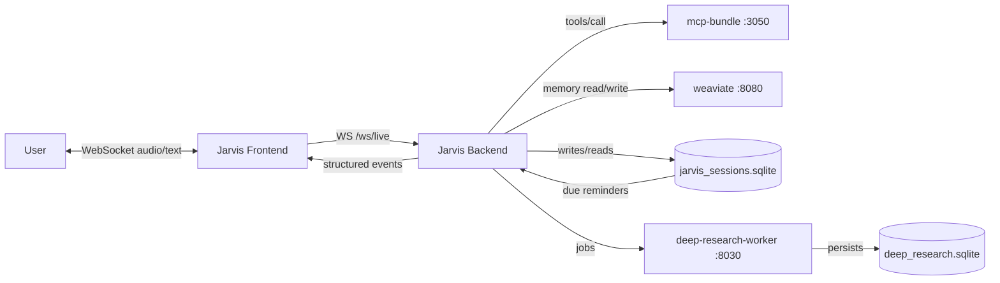
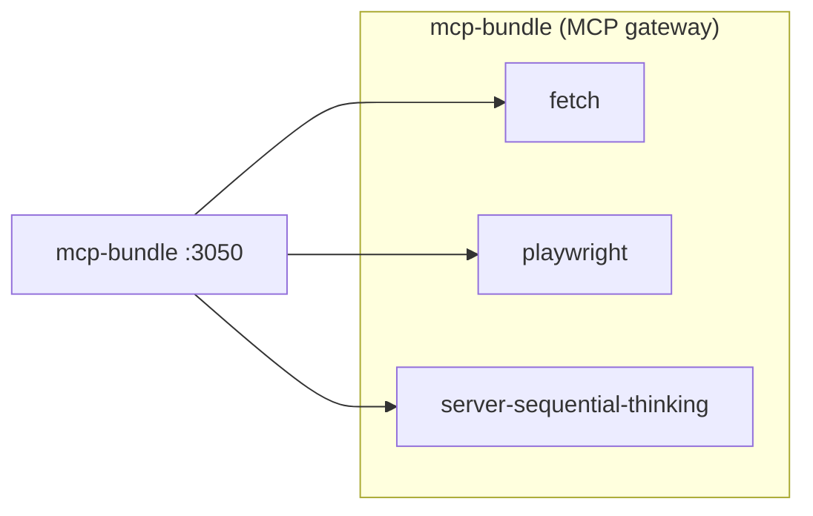
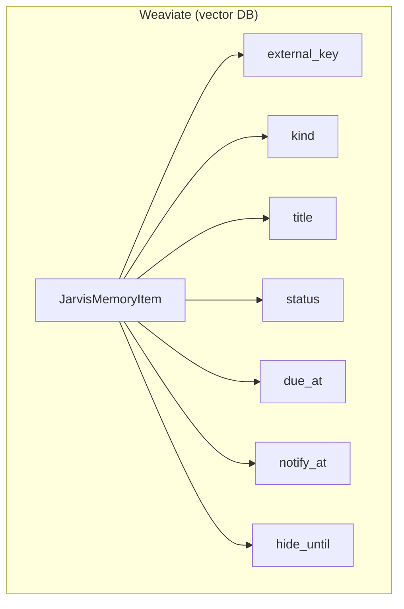
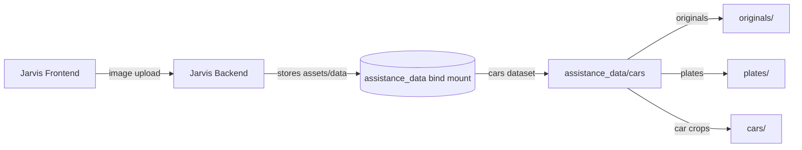

# Charts

These diagrams are the architecture blueprint for the `services/assistance` stack. Keep them accurate and update them whenever service boundaries, ports, endpoints, or persistence rules change.

## 1) System overview

## 2) MCP bundle (gateway)

## 3) Weaviate reminder fields

## 4) Cars (planned)

