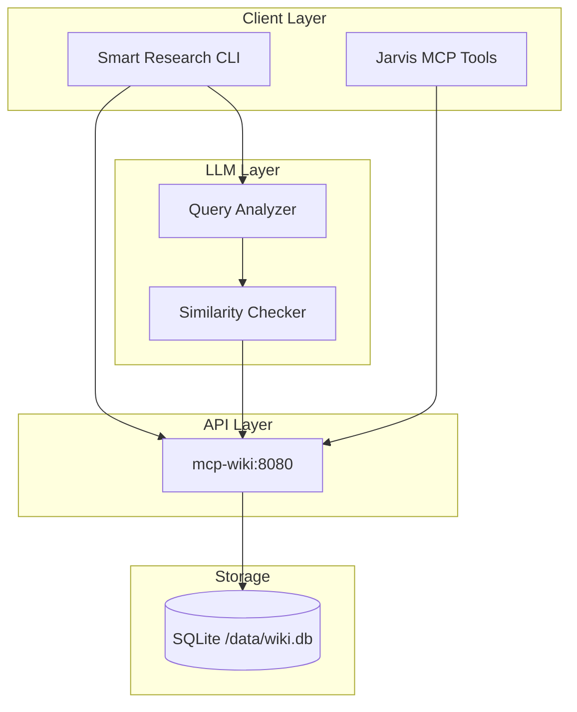
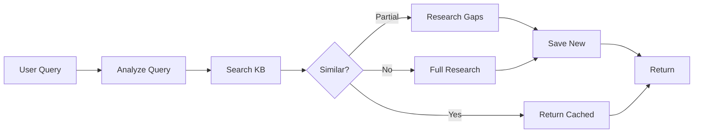
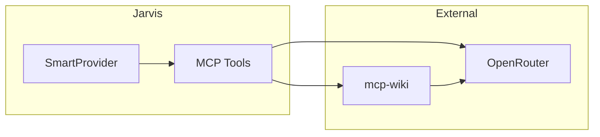

# MCP-Wiki: LLM-Powered Knowledge Base

## What is mcp-wiki?

**mcp-wiki** is a smart knowledge base service that combines traditional wiki storage with LLM-powered query analysis and semantic caching. It lives in the `idc1-db` stack.

## Architecture



## API Endpoints

| Method | Endpoint | Description |
|--------|----------|-------------|
| GET | `/api/search?q={query}` | Search articles |
| GET | `/api/articles?limit={n}` | List articles |
| GET | `/api/articles/{title}` | Get single article |
| POST | `/api/articles` | Create article |

## Smart Research Workflow



## Key Features

- **KB-First Caching**: Checks knowledge base before expensive LLM calls
- **Smart Similarity**: Uses LLM to compare queries vs existing articles
- **Gap-Aware Research**: Only researches missing information
- **Auto Cross-Reference**: Links related topics automatically

## Configuration

| Variable | Default | Description |
|----------|---------|-------------|
| `WIKI_API_URL` | `http://mcp-wiki:8080` | API endpoint |
| `DATABASE_URL` | - | Optional PostgreSQL |

## Usage

```python
from smart_research import WikiKnowledgeBase

kb = WikiKnowledgeBase("http://mcp-wiki:8080")

# Search
results = kb.search("docker best practices", limit=5)

# Get article
article = kb.get_article("Docker Networking")

# Save new knowledge
kb.save_article(
    title="New Topic",
    content="...",
    tags=["docker", "devops"],
    classification="tutorial"
)
```

## Integration



## Deployment

Part of `idc1-db` stack:

```yaml
services:
  mcp-wiki:
    image: chaban/mcp-wiki:latest
    ports:
      - "8080:8080"
    volumes:
      - wiki-data:/data
```

Access: `http://mcp-wiki:8080` (internal) or `http://idc1:8080` (external)
