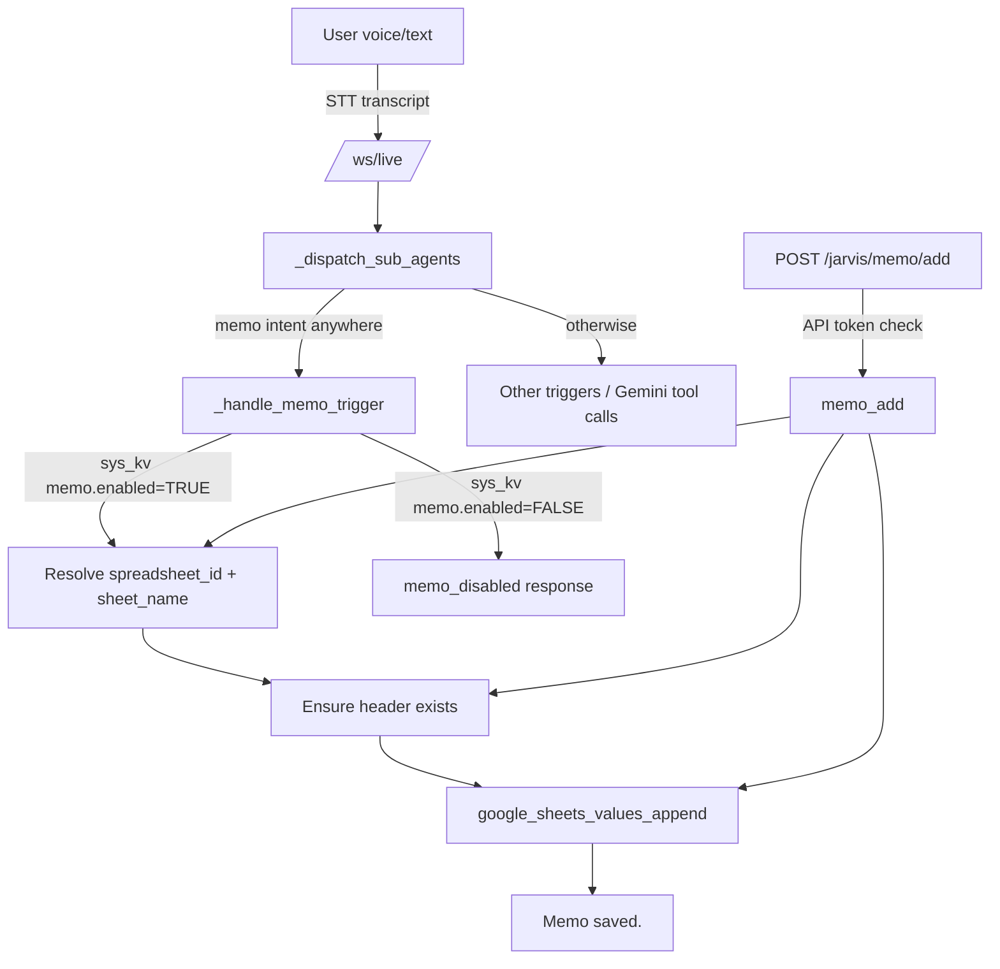

# Memo system

## Overview
The memo system provides a lightweight, append-only log into a Google Sheet tab (default: `memo`).

It supports two entry points:

- Voice/text commands over the Live WebSocket (`/ws/live`) routed through the memo trigger.
- Direct HTTP API call to `POST /jarvis/memo/add` (also exposed as `POST /memo/add`).

## System sheet (sys_kv) configuration
The memo system is controlled by keys in the *system sheet* KV (`sys_kv`).

Required:

- `memo.enabled`:
  - `TRUE` to enable memo.
  - If `FALSE`, memo commands are consumed and return `memo_disabled` (so they don’t fall back to memory/tasks).

- `memo.sheet_name` (or `memo_sheet_name` or `memo_sh`):
  - Sheet tab name (typically `memo`).

Optional (defaults to system spreadsheet if omitted):

- `memo.spreadsheet_id` (or `memo.spreadsheet_name` or `memo_ss`):
  - Spreadsheet ID for memo storage.

## Data model (Sheet header)
The backend ensures the memo sheet has a header row and will create it if missing.

Columns (current backend header):

- `date_time`
- `memo`
- `status`
- `group`
- `subject`
- `v`
- `result`
- `merged_into`
- `merged_at`
- `_merged`
- `_created`
- `_updated`

Rows are appended via Google Sheets `values.append`.

## Flow diagram



## Voice/text memo commands
Memo is handled server-side (pre-Gemini) via `_handle_memo_trigger`.

The trigger is designed to match memo intent **anywhere in the utterance**, including Thai combining-mark variants (e.g. `เมโม่` vs `เมโม`).

Examples:

- `memo: test`
- `create memo test`
- `ช่วยสร้างเมโม่ ทดสอบ 1`

Notes:

- If memo is enabled and the trigger matches, the system appends to the memo sheet.
- If memo is disabled, the system returns `memo_disabled` and does **not** fall back to memory/tasks.

## HTTP API

Endpoint:

- `POST /jarvis/memo/add` (alias: `POST /memo/add`)

Request JSON:

- `group` (string)
- `subject` (string)
- `memo` (string)
- `status` (optional)
- `v` (optional)
- `result` (optional)

The endpoint validates:

- API token if configured.
- `memo.enabled` in sys_kv.
- Memo sheet config.

Then ensures header and appends the row.

## Troubleshooting

### Symptom: voice “create memo” goes to memory/tasks
Check:

- `memo.enabled` is `TRUE` in sys_kv.
- Backend has been redeployed with the latest memo trigger logic.

### Symptom: `memo_sheet_missing_header`
This means the backend could not detect a valid header row after attempting to create it.

Check:

- The memo sheet tab name exists and matches `memo.sheet_name`.
- The Sheets credentials/service account has edit access.
- The sheet/tab is not protected in a way that blocks writing A1.

### Verify via curl

```bash
curl -sS -X POST https://assistance.idc1.surf-thailand.com/jarvis/api/jarvis/memo/add \
  -H 'content-type: application/json' \
  -H 'X-Api-Token: <TOKEN_IF_REQUIRED>' \
  -d '{"group":"ops","subject":"memo/test","memo":"hello"}'
```