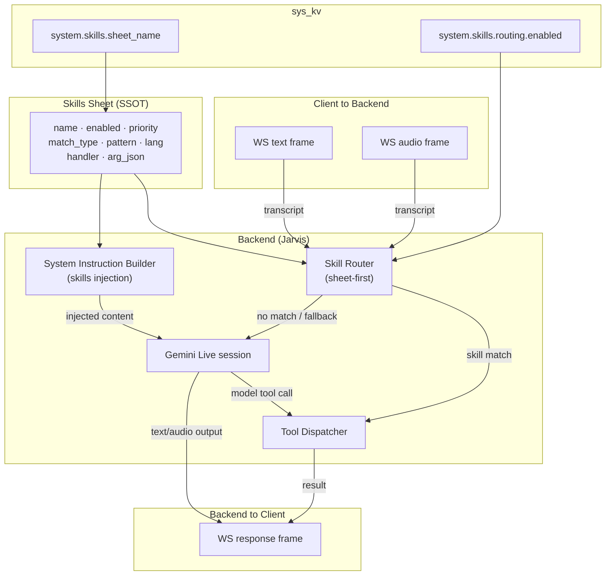

# Assistance Service — Overview

The assistance service (Jarvis) is the real-time conversational backend.  
It bridges WebSocket clients to Gemini Live and manages the complete request lifecycle, including skill routing, tool dispatch, and system-instruction assembly.

## Architecture

## Routing Layers (in order)

| Layer | Trigger | Description |
|-------|---------|-------------|
| **Sheet-first routing** | Input transcript matches a skill row `pattern` | Deterministic; bypasses Gemini for matched intents |
| **Gemini Live model** | Transcript forwarded when no sheet match | Gemini may emit a model tool call |
| **Legacy fallback** | `system.skills.routing.enabled = false` | Pre-sheet behaviour; all transcripts go straight to Gemini |

> Sheet-first routing is active only when `system.skills.routing.enabled` is `true` and a valid `system.skills.sheet_name` is set.

## Key Concepts

### Skills Sheet
A spreadsheet (or equivalent data source) identified by `system.skills.sheet_name` in `sys_kv`.  
Each row defines one skill — see [SYSTEM.md](SYSTEM.md) for the full schema.

### Skill injection into system instruction
At session start, enabled skill rows with `handler = inject` have their content folded into the effective system instruction in priority order.  This is a separate concern from routing; the same sheet drives both.

### Deterministic tool calls
Two observability tools are always available regardless of model state:
- `system_skills_list` — list all loaded skill rows and their status
- `system_skill_get { "name": "<name>" }` — fetch a single skill row

See [TOOLS.md](TOOLS.md) for the full tool reference.

## Operator Quick Links

| Task | Where |
|------|-------|
| Update skill rows | [SYSTEM.md — Skill row schema](SYSTEM.md#skill-row-schema) |
| Apply changes (reload) | [ACTION.md — Apply](ACTION.md#apply-system-reload) |
| Verify routing | [ACTION.md — Verify](ACTION.md#verify) |
| Full runbook | [ACTION.md](ACTION.md) |
