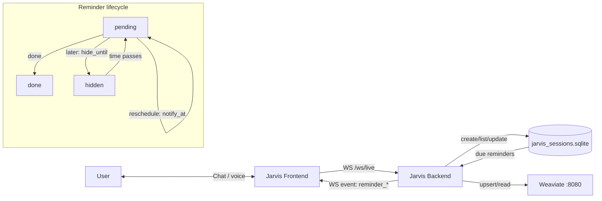

 # Reminders (Overview)

 See also:
 - `WINDSURF_PLAYBOOK.md` (repo working conventions, diagnostics, workflows)
 
 This document explains how reminders work end-to-end in the `idc1-assistance` stack.

## Current direction (Calendar cutover)

- **New reminders** are created as **Google Calendar events** in a dedicated calendar (default name: `Jarvis Reminders`) via the `mcp-google-calendar` MCP server.
- **Legacy reminders** (SQLite/Weaviate) remain **readable** and can still be marked `done`.
- The legacy local reminder scheduler loop is **disabled by default** to avoid double notifications.
  - Enable it only if needed via `JARVIS_LEGACY_REMINDER_NOTIFICATIONS_ENABLED=1`.
 
## What a reminder is

A reminder is a memory item with:
- **`kind=reminder`**
- **`status`**:
  - `pending` (active)
  - `done` (completed)
- **time fields** (unix timestamps in UTC):
  - `due_at` (the user-intended deadline)
  - `notify_at` (when Jarvis should notify)
  - `hide_until` (optional; temporarily hides the reminder from default lists)

## Data flow and storage (authoritative vs cache)

- **Weaviate** is the **authoritative** memory store (cross-session consistency).
- **SQLite (`jarvis_sessions.sqlite`)** is a **local scheduler cache** used for:
  - fast listing
  - local due checks
  - recovery when Weaviate is temporarily unavailable

Note:
- After the Calendar cutover, the legacy scheduler path is typically not used for new reminders; it remains for legacy reminders only.

## Weaviate reminder persistence

Legacy reminders are written to **SQLite first** (reliability + local scheduler), then (when enabled) written-through to **Weaviate** for cross-device consistency.

- **Enable Weaviate**:
  - Set `WEAVIATE_URL` (stack default is typically `http://weaviate:8080`).
- **Disable Weaviate (SQLite-only)**:
  - Unset `WEAVIATE_URL` or set it to an empty string.

Behavior:
- **Write-through**: if `WEAVIATE_URL` is set, create/update/done operations attempt a Weaviate upsert/update.
- **Authoritative reads**: when `WEAVIATE_URL` is set, list endpoints prefer Weaviate reads (with SQLite fallback on error).
- **Scheduler**: the reminder scheduler loop uses SQLite as its local due-check cache.

## Draft / confirmation flow (WS)

If the request is missing a clear time, the backend emits a **draft** and requires user confirmation before creating a scheduled reminder.

- Backend emits: `reminder_setup_draft`
- User replies with one of:
  - confirm:
    - English: `reminder confirm: <when>` or `reminder confirm`
    - Thai: `ยืนยัน: <when>` or `ยืนยัน`
  - cancel:
    - English: `reminder cancel`
    - Thai: `ยกเลิก`

Confirming **without** time will create an `unscheduled` reminder and then the next message can be **time-only** (e.g. `9 โมงเช้า`) to set the time.

## Title cleanup: strip time phrases

Titles are additionally cleaned to avoid leaking time phrases into the title.

Example input:
- `สร้างแจ้งเตือนใหม่ พรุ่งนี้ 9 โมงเช้า ตรวจงานเก็บกองกิ่งไม้...`

Expected title:
- `ตรวจงานเก็บกองกิ่งไม้...`

The backend uses a conservative regex-based stripper for common Thai/English time fragments (e.g. `พรุ่งนี้`, `9 โมงเช้า`, `17:00`, `tomorrow`, `9am`).

## Reminder title rewrite (optional)

The backend may optionally rewrite reminder titles to be clearer before creating the reminder.
This is best-effort and safe: if the rewrite model is unavailable / rate-limited / quota-limited, the backend will keep the original title.

Configuration (text model):
- `JARVIS_REMINDER_TITLE_MODELS` (comma-separated list; tried in order)
- `JARVIS_REMINDER_TITLE_MODEL` (single model; fallback)
- `GEMINI_TEXT_MODEL` (single model; fallback)

Notes:
- Model names may be provided with or without the `models/` prefix.
- If `JARVIS_REMINDER_TITLE_MODELS` is unset, the backend uses a cheap-first default fallback list.

Confirmed available model IDs (via Gemini API `models.list()` from the running `jarvis-backend` container):
- `models/gemini-2.0-flash-lite`
- `models/gemini-2.0-flash-lite-001`
- `models/gemini-2.0-flash`
- `models/gemini-2.0-flash-001`
- `models/gemini-flash-lite-latest`
- `models/gemini-flash-latest`
- `models/gemini-pro-latest`

## Common operations

- **List reminders**
  - Default behavior typically excludes hidden items (those with `hide_until` in the future).
- **Done**
  - Marks a reminder completed so it stops showing in “today” and “upcoming”.
- **Later**
  - Sets `hide_until` to temporarily hide a reminder.
- **Reschedule**
  - Updates `notify_at` (and typically clears `hide_until`).

### Modify / reschedule via Thai follow-ups (no reminder_id)

For voice/chat follow-ups like `เปลี่ยนเวลา` / `เปลี่ยนเป็น 9 โมงเช้า`, the backend targets a reminder using this precedence:

1. Pending modify target (after the user says `เปลี่ยนเวลา` and is prompted for a time)
2. Last mentioned/selected reminder (from list results or explicit `done/later/reschedule/delete` actions)
3. Last created/confirmed reminder

Supported examples:
- `เปลี่ยนเป็น 9 โมงเช้า`
- `เปลี่ยนเวลา` then `9 โมงเช้า`

## Backend HTTP endpoints

Operator SSOT:

- `docs/ACTION.md` (runbooks + what to run next)

API SSOT:

- Prefer the live backend OpenAPI: `GET /openapi.json`

## WebSocket quick commands

Operator SSOT:

- `docs/ACTION.md` (smoke checklist + WS helpers)

## Debugging reminders (WS)

The frontend Operation Log attaches debugging metadata to most WS events:

- `trace_id` (correlates a user action across frontend/backend logs)
- WS event metadata (`type`, `instance_id`)
- raw WS JSON payload (expand any Operation Log entry)

If an issue is hard to reproduce, enable backend WS recording and replay:

- Enable recording:
  - `JARVIS_WS_RECORD=1`
  - optional `JARVIS_WS_RECORD_PATH=/tmp/jarvis-ws.jsonl`
- Replay captured inbound `text` messages:
  - `python3 services/assistance/jarvis-backend/ws_replay.py /tmp/jarvis-ws.jsonl`

Thai quick commands (aliases):

- `แสดงการแจ้งเตือน` (list)
- `รายการแจ้งเตือน` (list)
- `แสดงรายการแจ้งเตือน` (list)
- `เตือน เพิ่ม <text>` (add)
- `เตือน เสร็จ <reminder_id>` (done)
- `เตือน ลบ <reminder_id>` (delete)
- `เตือน เลื่อน <reminder_id> <when>` (reschedule)

Details (last selected/last created):

- Thai: `รายละเอียดแจ้งเตือน`
- English: `reminder details`

## WebSocket event glossary (reminders)

- `reminder_setup_draft`
  - emitted when the backend needs confirmation (usually missing time)
- `reminder_setup`
  - emitted when a reminder is created
- `reminder_setup_cancelled`
  - emitted when a draft is cancelled
- `reminder_modified`
  - emitted when a reminder time is updated via follow-up / modify flow
- `reminder_detail`
  - emitted when requesting details for the last selected/last created reminder
