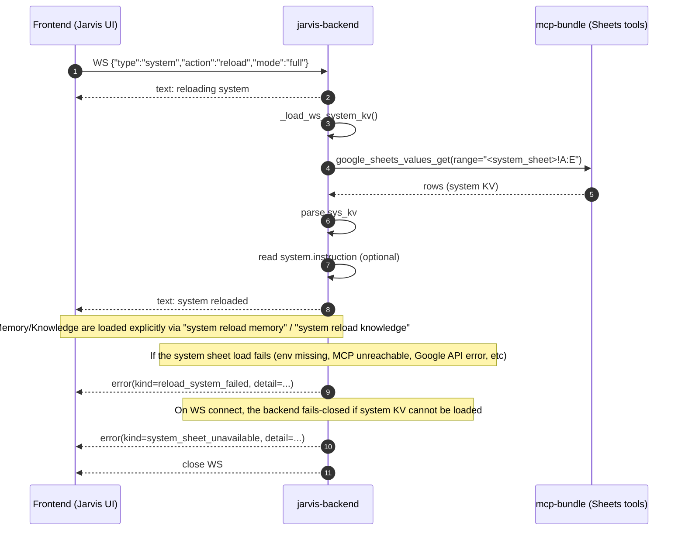
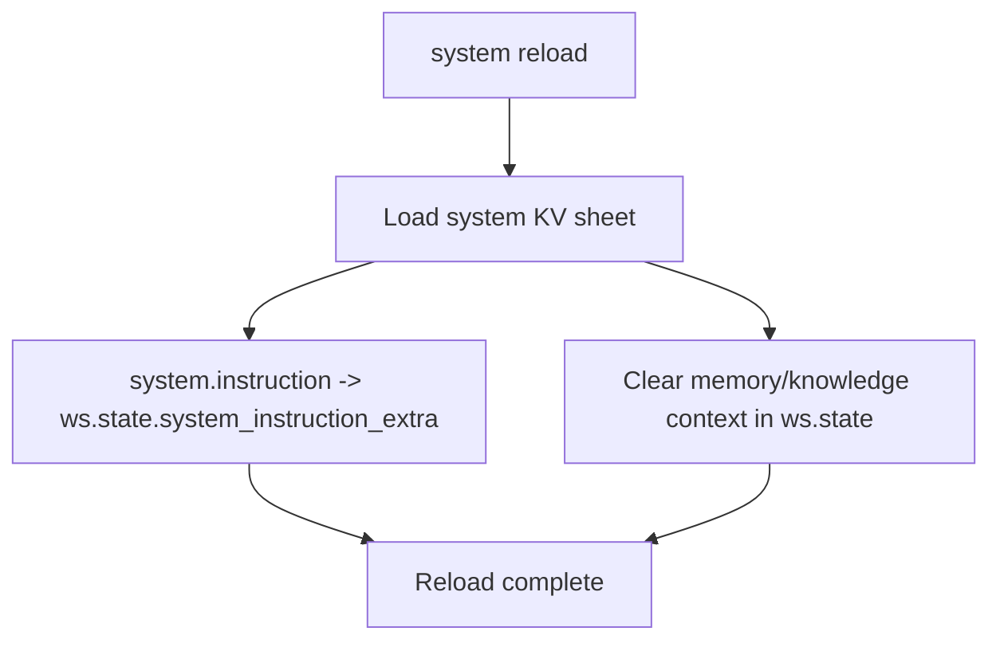
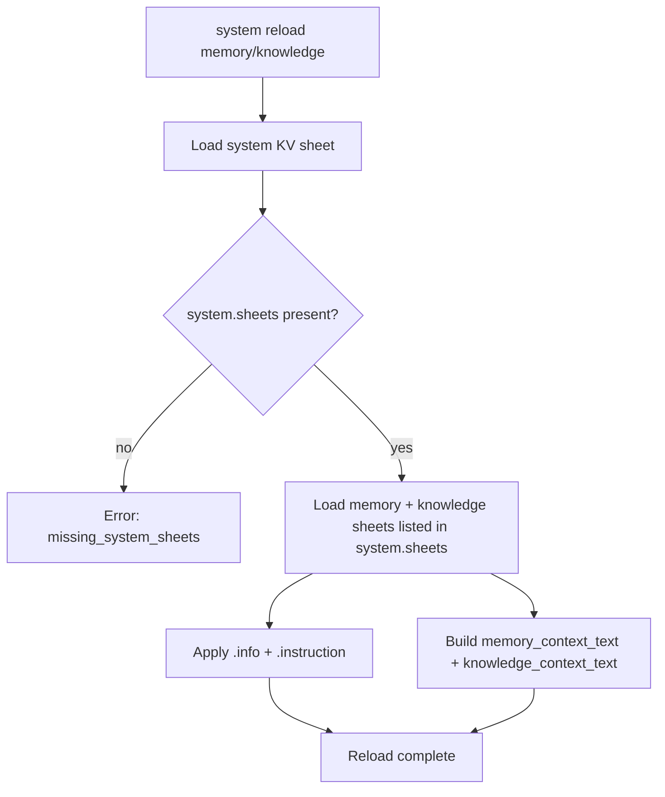

# Jarvis System Sheets

This document describes how Jarvis loads the **system sheet** and how `system reload` works end-to-end.

## Environment variables

Jarvis requires these environment variables:

- `CHABA_SYSTEM_SPREADSHEET_ID`
- `CHABA_SYSTEM_SHEET_NAME`

Notes:
- Effective deployed base URL + operator procedures: `services/assistance/docs/ACTION.md`
- Runtime endpoints: `GET /openapi.json`

## Skills Sheet SSOT routing

Jarvis can treat the **Skills Sheet** as the single source of truth (SSOT) for:

- Skill routing (sheet-first dispatch)
- System-instruction injection (inject-only rows)

The active sheet is identified by sys_kv key:

- `system.skills.sheet_name`

Routing can be enabled/disabled by:

- `system.skills.routing.enabled` (default `false`)

### Skill row schema

| Column | Type | Required | Description |
|---|---:|:---:|---|
| `name` | string | ✓ | Unique identifier for the skill (unique key) |
| `enabled` | boolean | ✓ | `true` to activate; `false` to ignore |
| `priority` | integer | ✓ | Lower number runs earlier (tie-break + injection order) |
| `match_type` | enum | — | `exact`, `prefix`, `regex`, or `none` (inject-only) |
| `pattern` | string | — | Match pattern, interpreted per `match_type` |
| `lang` | string | — | Optional language tag (e.g. `th`, `en`) |
| `handler` | enum | ✓ | `tool_call`, `inject`, or `passthrough` |
| `arg_json` | JSON string | — | Optional handler args (for `tool_call`: `{ "tool": "...", "args": {...} }`) |

Operator procedure (update → reload → verify): `services/assistance/docs/ACTION.md`.

## Adaptive news tuning (SSOT-first)

Goal:

- Keep `news_topics` / `news_sources` as the SSOT for the news system.
- Allow Jarvis to improve topics/sources based on usage, without silent writes.

Approach:

- Observe usage signals (e.g. `current_news_get`, topic details opens, refresh frequency, explicit feedback phrases).
- Generate *suggestions* (sheet diffs) for:
  - `news_topics` keyword tweaks / new topics
  - `news_sources` enable/disable, weights/throttles
- Present suggestions as a **Pending confirmation** item.
- Only write to Sheets after explicit user confirmation.

Skills Sheet integration (minimum hardcode):

- Add skills rows that map natural language like "improve news topics" / "ข่าวนี้ไม่เกี่ยว" to deterministic tool calls:
  - `news_tuning_suggest` (no writes)
  - `news_tuning_apply` (writes after confirmation)

Notes:

- Auto-create is allowed, but should be created as *disabled* until confirmed.
- The sheet remains authoritative; SQLite/runtime state stores only derived metrics (usage stats, cache metadata).

## System KV keys

### `system.sheets` (required)

`system.sheets` is a comma-separated list of sheet spec tokens.

Supported forms:

- `memory,knowledge`
- `memory:<TAB_NAME>,knowledge:<TAB_NAME>`

Notes:

- Tokens are **not** `key=value` pairs. `=` is invalid.
- Inline `#` comments are allowed per line (text after `#` is ignored).
- The loader expects to find both `memory` and `knowledge` entries.
- `notes:*` entries are not supported in `system.sheets`. Notes are configured separately via `notes_ss` + `notes.sheet_name` (or `notes_sh`).

System KV table rows honor the `enabled` column. Disabled rows are ignored.

### Per-sheet metadata (optional)

For each sheet role (`memory`, `knowledge`) you can provide:

- `<sheet>.info`
- `<sheet>.instruction`

Examples:

- `memory.info=System memory for internal usage.`
- `memory.instruction=Prefer memory items when answering user-specific questions.`
- `knowledge.info=Internal knowledge base.`
- `knowledge.instruction=Use knowledge items as canonical definitions and policies.`

### `system.instruction` (recommended)

`system.instruction` is a free-form instruction string injected into Gemini system prompts.

Recommended pattern (keep it short and imperative):

```text
When you need Memory/Knowledge, do NOT assume it is loaded.
If Memory/Knowledge is needed, ask the user to run:
- system reload memory
- system reload knowledge
Then continue using the loaded context.
```

### `system.instructions.*` (ordered instruction blocks)

In addition to the single `system.instruction` string, Jarvis supports ordered instruction blocks using keys:

- `system.instructions.<priority_int>`

Behavior:

- All enabled `system.instructions.*` keys are collected.
- `<priority_int>` is parsed as an integer; lower numbers come first.
- If parsing fails, the block is treated as very low priority (comes last).
- Final system instruction text is built as:
  - `system.instruction` (if present)
  - then the ordered `system.instructions.*` blocks

This is used to make NL routing and policies sheet-driven.

### Macros-only mode (tool surface restriction)

Key:

- `system.macros.only=true`

When enabled, the backend filters tool declarations so Gemini can only see tools prefixed with `system_*` and `macro_*`.

### Macro registry injection (NL routing helper)

Keys:

- `system.macros.registry.enabled` (default true)
- `system.macros.registry.max_items` (default 30)

When enabled, Jarvis injects a compact macro registry summary into the Gemini system prompt so the model can route NL requests to the appropriate `macro_*` tool.

### Macro fixtures + evaluator (self-test loop)

Keys:

- `system.macros.fixtures.sheet_name` (default `macro_fixtures`)
- `system.macros.evaluator.enabled` (default false)

Notes:

- `system_macro_test_run` reads fixtures from the fixtures sheet.
- `system_macro_test_evaluate` is disabled unless explicitly enabled and can optionally queue a pending macro upsert bundle.

### Portainer integration (module/container status report)

Jarvis supports a deterministic WS action:

- `{"type":"system","action":"module_status_report"}`

This queries the Portainer HTTP API (Docker proxy) to list containers for a given stack and emits a one-line-per-container status report.

Configuration is read from the **system sheet KV** (preferred) with environment variable fallbacks.

Required keys (system sheet KV):

- `portainer.url`
- `portainer.token`
- `portainer.endpoint_id`
- `portainer.stack_name`

Environment fallbacks:

- `PORTAINER_URL`
- `PORTAINER_TOKEN`
- `PORTAINER_ENDPOINT_ID`
- `PORTAINER_STACK_NAME`

Notes:

- `portainer.token` is sent as `X-API-Key` and should be treated as a secret.
- `portainer.stack_name` should match the compose project / stack namespace label on containers.
  - Split-stack deployments commonly use one of:
    - `idc1-assistance-core`
    - `idc1-assistance-infra`
    - `idc1-assistance-mcp`
    - `idc1-assistance-workers`

## Backend reload flow (diagram)



### Explanation

- Jarvis treats the **system sheet** as authoritative configuration.
- `system.sheets` controls which sheet tabs are loaded after the system KV is loaded.
- Jarvis does **not** silently fall back to defaults; missing config is reported as an error to make debugging easier.

## Startup prewarm + client connect status

## Fail-closed on system sheet

Jarvis treats the **system sheet** as authoritative configuration.

If the backend cannot load the system KV sheet on WebSocket connect, it fails closed:

- emits a WS `error` with `kind=system_sheet_unavailable`
- includes a debug `detail` payload
- closes the WebSocket (so the issue must be fixed before continuing)

Required env vars:

- `CHABA_SYSTEM_SPREADSHEET_ID`
- `CHABA_SYSTEM_SHEET_NAME`

### Startup prewarm

When `jarvis-backend` starts (even if no UI is connected), it runs a background prewarm job that tries to load:

- system KV sheet
- (best-effort) memory/knowledge via `system.sheets`

The prewarm loader performs a short retry loop with backoff. If a dependency is not ready yet (most commonly the MCP bundle or network/DNS during early container startup), the backend will retry a few times before reporting a failure.

If no UI is connected, no WebSocket messages are emitted. The result is only visible in backend logs.

### Client connect status

When a client connects to `/ws/live`, the backend sends short status lines:

- A cache-based sheet summary (memory/knowledge sheet names + counts)
- A startup prewarm summary:
  - `Startup prewarm: ok | memory=X knowledge=Y`
  - or `Startup prewarm: error | <reason>`

The cache-based sheet summary uses the format:

- `memory(<cache_count>:<loaded_in_session>)`
- `knowledge(<cache_count>:<loaded_in_session>)`

Where:

- `<cache_count>` is the number of items currently stored in the backend cache.
- `<loaded_in_session>` is the number of items loaded into the current WebSocket session state.

Note: `system reload` now only reloads the system KV sheet. Use `system reload memory` / `system reload knowledge` to load the sheet contexts into the current chat session.

## Logs (persistent)

Jarvis has two daily logs:

- **UI Operation Log**
  - Persisted in the browser via `localStorage` (key: `jarvis_ui_log_YYYY-MM-DD`)
  - Also batched and appended to the backend daily log file via HTTP
- **Backend WS Log**
  - A daily-rotated JSONL file of WebSocket frames recorded by the backend (when enabled)

### Backend endpoints

SSOT:

- Operator runbooks: `services/assistance/docs/ACTION.md`
- Runtime API surface: `GET /openapi.json` (deployed base URL is documented in `ACTION.md`)

### Backend storage

- **Env:** `JARVIS_LOGS_DIR` (default: `/data/jarvis_logs`)
  - UI daily file: `jarvis-ui-YYYY-MM-DD.jsonl`
  - WS daily file: `jarvis-ws-YYYY-MM-DD.jsonl`

### Enabling WS recording

WS log recording is enabled when either is set:

- `JARVIS_WS_RECORD=1`
- or `JARVIS_WS_RECORD_PATH=/some/path.jsonl`

If `JARVIS_WS_RECORD_PATH` is not set, the backend writes to the daily path under `JARVIS_LOGS_DIR`.

## System sheet reload (diagram)



### Explanation

- `system.instruction` is optional and is injected into Gemini system prompts (Live and non-Live) as extra guidance.
- `<sheet>.info` is optional and is included near the top of the corresponding context block.
- `<sheet>.instruction` is optional and is injected into Gemini system prompts as extra guidance about how to use that sheet.

## Explicit memory/knowledge reload (diagram)

Use these commands to load sheet context into the current chat session:

- `system reload memory`
- `system reload knowledge`



### Explanation

- `system.sheets` must include entries for both `memory` and `knowledge`.
- Each sheet loaded via `_load_sheet_kv5` expects columns: `key,value,enabled,scope,priority`.