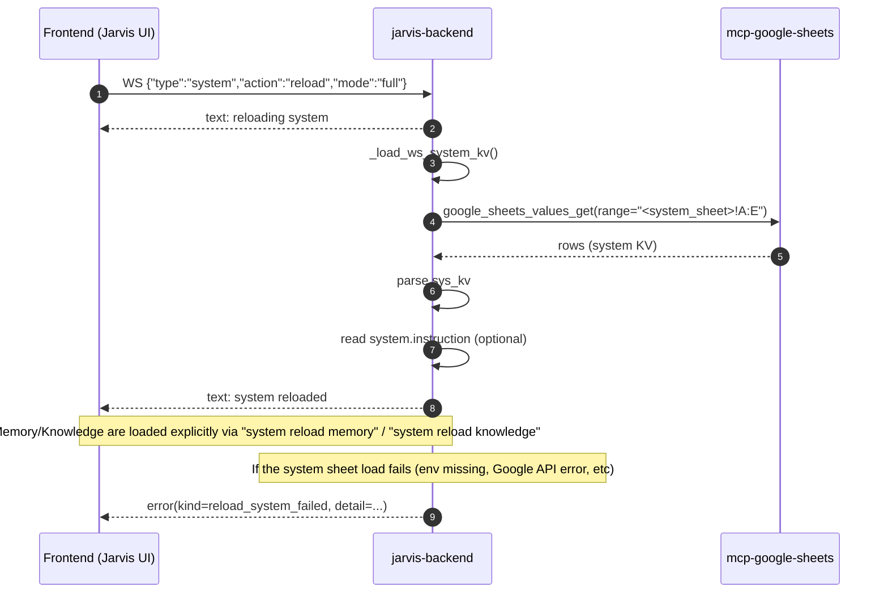
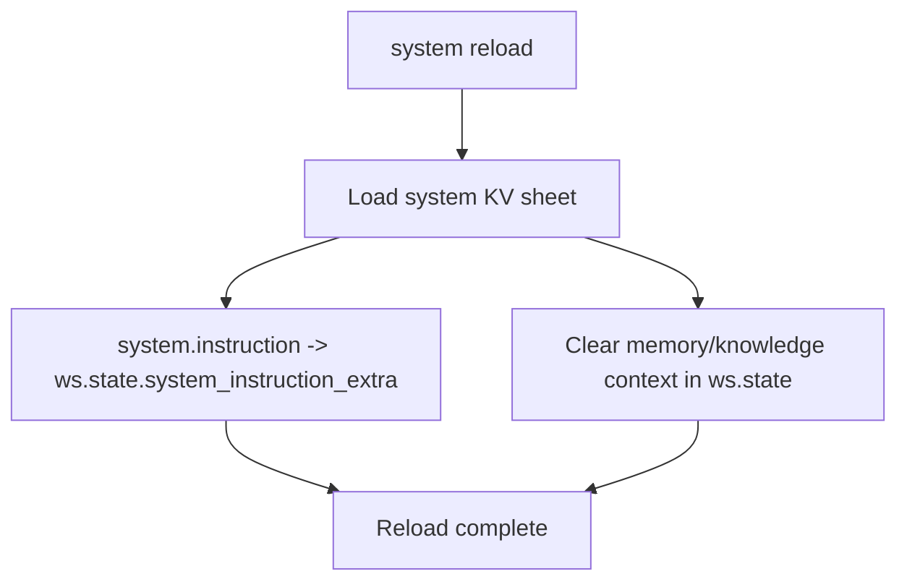
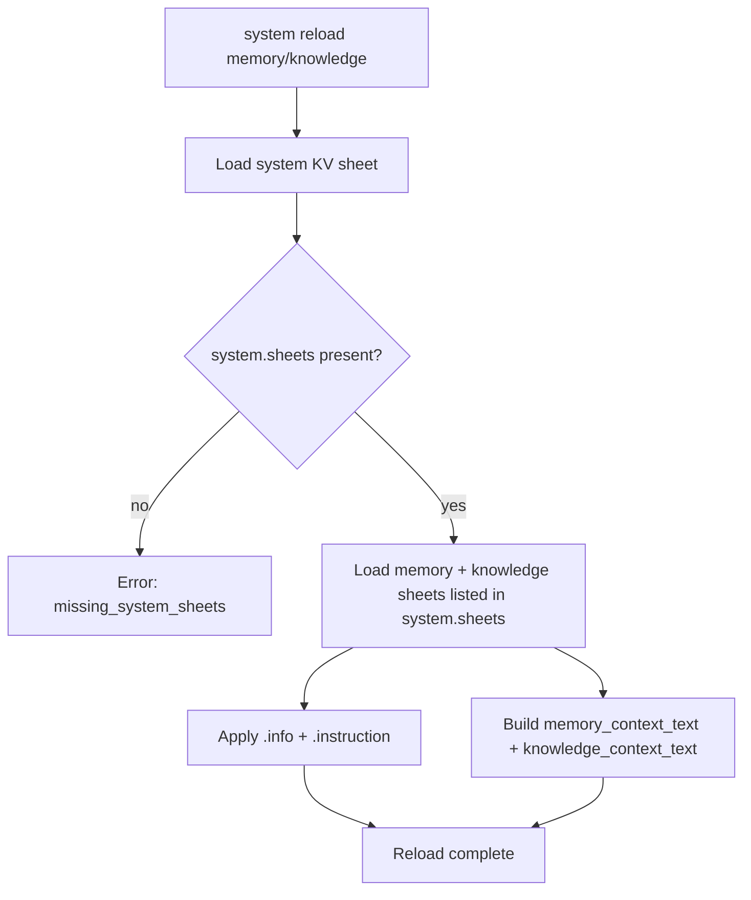

# Jarvis System Sheets

This document describes how Jarvis loads the **system sheet** and how `system reload` works end-to-end.

## Environment variables

Jarvis requires these environment variables:

- `CHABA_SYSTEM_SPREADSHEET_ID`
- `CHABA_SYSTEM_SHEET_NAME`

## System KV keys

### `system.sheets` (required)

`system.sheets` is a comma-separated list of sheet spec tokens.

Supported forms:

- `memory,knowledge`
- `memory:<TAB_NAME>,knowledge:<TAB_NAME>`

Notes:

- Tokens are **not** `key=value` pairs. `=` is invalid.
- The loader expects to find both `memory` and `knowledge` entries.

### Per-sheet metadata (optional)

For each sheet role (`memory`, `knowledge`) you can provide:

- `<sheet>.info`
- `<sheet>.instruction`

Examples:

- `memory.info=System memory for internal usage.`
- `memory.instruction=Prefer memory items when answering user-specific questions.`
- `knowledge.info=Internal knowledge base.`
- `knowledge.instruction=Use knowledge items as canonical definitions and policies.`

### `system.instruction` (recommended)

`system.instruction` is a free-form instruction string injected into Gemini system prompts.

Recommended pattern (keep it short and imperative):

```text
When you need Memory/Knowledge, do NOT assume it is loaded.
If Memory/Knowledge is needed, ask the user to run:
- system reload memory
- system reload knowledge
Then continue using the loaded context.
```

## Backend reload flow (diagram)



### Explanation

- Jarvis treats the **system sheet** as authoritative configuration.
- `system.sheets` controls which sheet tabs are loaded after the system KV is loaded.
- Jarvis does **not** silently fall back to defaults; missing config is reported as an error to make debugging easier.

## Startup prewarm + client connect status

### Startup prewarm

When `jarvis-backend` starts (even if no UI is connected), it runs a background prewarm job that tries to load:

- system KV sheet
- (best-effort) memory/knowledge via `system.sheets`

If no UI is connected, no WebSocket messages are emitted. The result is only visible in backend logs.

### Client connect status

When a client connects to `/ws/live`, the backend sends short status lines:

- A cache-based sheet summary (memory/knowledge sheet names + counts)
- A startup prewarm summary:
  - `Startup prewarm: ok | memory=X knowledge=Y`
  - or `Startup prewarm: error | <reason>`

Note: `system reload` now only reloads the system KV sheet. Use `system reload memory` / `system reload knowledge` to load the sheet contexts into the current chat session.

## System sheet reload (diagram)



### Explanation

- `system.instruction` is optional and is injected into Gemini system prompts (Live and non-Live) as extra guidance.
- `<sheet>.info` is optional and is included near the top of the corresponding context block.
- `<sheet>.instruction` is optional and is injected into Gemini system prompts as extra guidance about how to use that sheet.

## Explicit memory/knowledge reload (diagram)

Use these commands to load sheet context into the current chat session:

- `system reload memory`
- `system reload knowledge`



### Explanation

- `system.sheets` must include entries for both `memory` and `knowledge`.
- Each sheet loaded via `_load_sheet_kv5` expects columns: `key,value,enabled,scope,priority`.