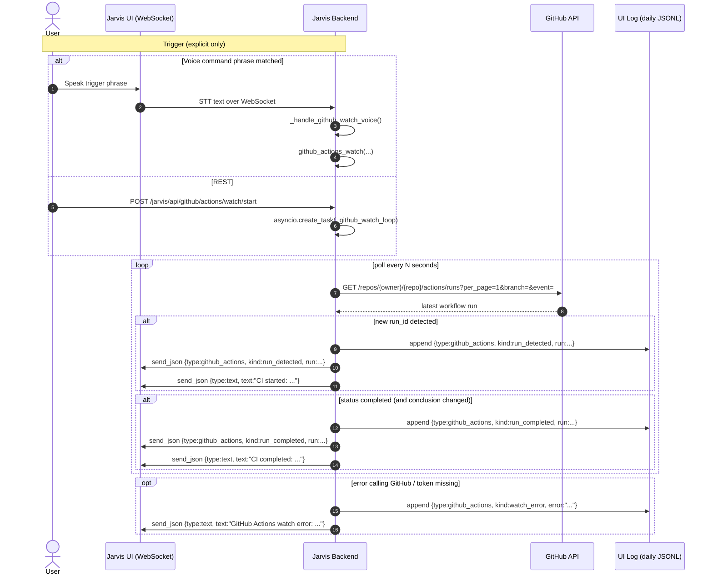

# Test info

Operator SSOT:

- `services/assistance/docs/ACTION.md`

API SSOT:

- Prefer the live backend OpenAPI: `GET /openapi.json`

## Context

This file is a scratchpad for validating the GitHub Actions watcher integration in Jarvis.

Core goal:

- The watcher should only trigger when explicitly invoked (voice command / explicit REST call), not continuously.
- When a workflow run is detected and later completes, Jarvis should:
  - Broadcast events to connected Jarvis UI WebSockets.
  - Persist a minimal audit trail in the UI daily log (JSONL) so events are visible even if no WebSocket was connected.

Relevant backend pieces:

- **Watcher loop**: `services/assistance/jarvis-backend/main.py::_github_watch_loop`
- **Broadcast**: `main.py::_broadcast_to_user` (WebSocket only)
- **Persisted UI log**: `main.py::_append_ui_log_entries` and endpoint `GET /jarvis/api/logs/ui/today`

Event kinds written to UI log:

- `run_detected`
- `run_completed`
- `watch_error`

## Diagram

## Quick checks

- **Watcher running**: `GET /jarvis/api/github/actions/watch/list`
- **Latest run**: `GET /jarvis/api/github/actions/latest`
- **Persisted events**: `GET /jarvis/api/logs/ui/today` then search for `"type": "github_actions"`