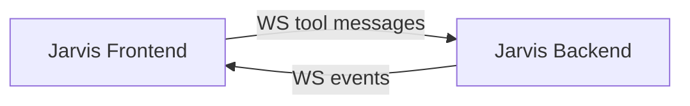
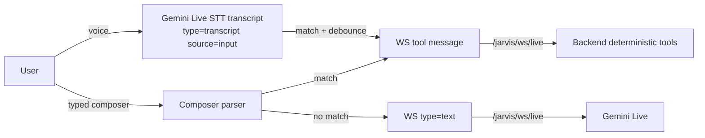

# Tools charts

```mermaid
flowchart TB
  UI[Jarvis Frontend] -- WS /jarvis/ws/live --> BE[Jarvis Backend]

  subgraph Deterministic Tools (Mode B)
    BE --> SYS[system.*]
    BE --> NOTES[notes.*]
    BE --> REM[reminders.*]
    BE --> GEMS[gems.*]
  end

  BE -- audio/text --> GL[Gemini Live]
  GL -- tool_call --> BE
  BE -- MCP JSON-RPC --> MCP[mcp-bundle / 1MCP servers]
  MCP -- results --> BE
  BE -- FunctionResponse --> GL

  BE -- WS events --> UI
```

This file documents the main **tool surfaces** available in the Assistance stack.

Rules:

- No secrets in this file.
- Prefer documenting **stable message schemas** and how they route through the system.

## Chart: Jarvis Live WebSocket (`/jarvis/ws/live`)

The Jarvis UI talks to the backend over a single WebSocket.

Inbound (client -> backend) message types:

| `type` | Purpose | Key fields | Routed to |
|---|---|---|---|
| `text` | Normal chat input | `text` | Gemini Live (unless intercepted by backend sub-agents) |
| `audio` | Microphone audio frame | `data` (base64), optional `mimeType` | Gemini Live realtime input |
| `audio_stream_end` | End of current audio stream | none | Gemini Live realtime input |
| `cars_ingest_image` | Send an image for car/plate ingest | `data` (base64), `mimeType`, `request_id` | Backend only |
| `system` | Deterministic backend system tools | `action`, `mode` | Backend only (never forwarded to Gemini) |
| `notes` | Deterministic backend notes tools | `action`, `text` | Backend only (never forwarded to Gemini) |
| `reminders` | Deterministic backend reminders tools | `action`, `text`, `reminder_id`, `when` | Backend only (never forwarded to Gemini) |
| `memory` | Deterministic backend memory tools (authoritative sheet write/read) | `action`, `key`, `value`, `scope`, `priority`, `query` | Backend only (never forwarded to Gemini) |

Outbound (backend -> client) message types (selected):

| `type` | Meaning | Notes |
|---|---|---|
| `state` | connection state | e.g. `connected` |
| `text` | plain text message | model output or backend status lines |
| `transcript` | speech-to-text transcript | `source=input|output` |
| `audio` | PCM audio chunk (base64) | UI plays audio |
| `error` | structured error | `kind`, `message`, optional `detail` |
| `note_created` | note appended to notes sheet | includes best-effort note id |
| `note_prompt` | follow-up needed to complete note | UI can prompt user |

## Chart: Deterministic backend tools (WS messages)

These messages are handled **purely by the backend** and are never forwarded to Gemini.



## Chart: Deterministic Gemini function tools (backend-implemented)

These tools are exposed to Gemini Live as **function calls**, but are still **deterministic** because the backend implements them directly (they are not free-form model output).

Key properties:

- The model chooses *when* to call them, but the backend enforces:
  - Sys-sheet gates (e.g. `memo.enabled`, `memory.write.enabled`)
  - Validation (required fields)
  - Consistent side effects (Sheets write / DB read)
- If these tools are available, Gemini should prefer them over “guessing” a calendar/task workflow.

```mermaid
flowchart TB
  GL[Gemini Live] -->|tool_call: name+args| BE[Jarvis Backend]
  subgraph Backend deterministic function tools
    BE --> TN[time_now]
    BE --> SL[session_last_get]
    BE --> MEMADD[memory_add]
    BE --> MEMS[memory_search]
    BE --> MEML[memory_list]
    BE --> MADD[memo_add]
    BE --> PL[pending_list]
    BE --> PC[pending_confirm]
    BE --> PX[pending_cancel]
  end
  BE -->|FunctionResponse| GL
  BE -->|MCP JSON-RPC (Sheets/Calendar/Tasks/etc.)| MCP[MCP servers]
```

### Tool: `memo_add`

Purpose: append a memo row to the memo Google Sheet (same data model as `POST /jarvis/memo/add`).

Gates (sys sheet KV):

- `memo.enabled=true`
- `memo.sheet_name` (and optionally `memo.spreadsheet_id`)

Function signature:

- `memo_add({ memo, group?, subject?, status?, v?, result? })`

Behavior:

- Ensures memo sheet header exists (best-effort create if missing).
- Appends a row via Sheets `values.append`.

### Tool: `memory_add`

Purpose: upsert an authoritative memory item into the Memory sheet (hybrid mode).

Gates (sys sheet KV):

- `memory.write.enabled=true`
- `memory.autowrite.enabled=true`

Function signature:

- `memory_add({ key?, value, scope?, priority? })`

### Tool: `memory_search` / `memory_list`

Purpose: search or list loaded memory items.

- `memory_search({ query, limit? })`
- `memory_list({ limit? })`

### Tool: `time_now`

Purpose: authoritative current time.

- `time_now({ timezone? })`

### Tool: `session_last_get`

Purpose: fetch “last created/modified” object for the current voice session.

- `session_last_get({ slot: "last_created"|"last_modified" })`

### Tools: `pending_list` / `pending_confirm` / `pending_cancel`

Purpose: manage queued “pending” actions (confirmation-based writes).

- `pending_list({})`
- `pending_confirm({ confirmation_id })`
- `pending_cancel({ confirmation_id })`

### Tool chart: memory.*

Purpose: read/write authoritative memory items in the Memory Sheet (KV5 schema: key,value,enabled,scope,priority).

```mermaid
flowchart LR
  FE[Frontend] -->|{"type":"memory","action":"add","key":"...","value":"..."}| BE[Backend]
  BE -->|memory_created / error| FE
  FE -->|{"type":"memory","action":"search","query":"..."}| BE
  BE -->|text (list of matching keys)| FE
```

Supported actions:

- **`add`**: upsert by `key` (update if exists, else append)
- **`get`**: fetch by `key`
- **`search`**: keyword search over loaded memory
- **`summary` / `list`**: show top loaded items

Write safety switches (system sheet KV):

- `memory.write.enabled` (default `true`)
- `memory.autowrite.enabled` (default `true`) — used by Gemini tool calls

Gemini Live tools (function calls) exposed by backend:

- `memory_add({key?, value, scope?, priority?})`
- `memory_search({query, limit?})`
- `memory_list({limit?})`

### Tool chart: system.reload

```mermaid
flowchart LR
  FE[Frontend] -->|{"type":"system","action":"reload","mode":...}| BE[Backend]
  BE -->|text/progress| FE
  BE -->|error(kind=invalid_reload_mode/reload_failed)| FE
```

### Tool: system.clear_job (clear in-flight Gemini job)

Purpose: stop any in-flight Gemini Live actions (e.g. unwanted MCP tool calls) by forcing a clean reconnect.

Inbound (client -> backend):

```json
{"type":"system","action":"clear_job"}
```

Typed shortcuts (frontend smart mapping):

- `system clear job`
- `/system clear job`

Outbound (backend -> client):

- `type=text`: `system.clear_job: reconnecting`
- `type=reconnect` with `reason=system_clear_job` (frontend disconnects and reconnects)

### Tool: system.sys_kv_set (write sys sheet KV)

Writes a single key/value into the authoritative `sys` sheet (KV table) using MCP Google Sheets write tools.

Inbound (client -> backend):

```json
{"type":"system","action":"sys_kv_set","key":"voice.job_done","value":"true"}
```

Optional:

```json
{"type":"system","action":"sys_kv_set","key":"voice.job_done","value":"true","dry_run":true}
```

Safety gate (default **disabled**):

- Enable sheet writes by setting sys kv key `sys_kv.write.enabled=true`.

Outbound (backend -> client) on success:

- `type=text` status line, and a `sys_kv_set` object containing append/update details.

On failure:

- `type=error` with `kind=sys_kv_write_disabled|sys_kv_set_failed`.

## Sheet-driven config: Voice command routing (frontend)

The frontend has a voice UX fallback that can auto-trigger deterministic WS tool messages from **input transcripts** (when Gemini doesn't emit a tool call for simple commands).

This routing is now configurable via sys sheet keys and exposed via HTTP:

- `GET /jarvis/config/voice_commands` (when reverse-proxied under `/jarvis`)
- `GET /config/voice_commands` (direct backend)

Response:

```json
{"ok":true,"config":{...}}
```

Supported sys kv keys (defaults shown):

- `voice_cmd.enabled=true`
- `voice_cmd.debounce_ms=10000`
- `voice_cmd.reload.enabled=true`
- `voice_cmd.reload.phrases=` (optional; if empty, frontend uses built-in heuristics)
- `voice_cmd.reload.keywords.gems=gems,gem,models,model,เจม,โมเดล`
- `voice_cmd.reload.keywords.knowledge=knowledge,kb,know,ความรู้`
- `voice_cmd.reload.keywords.memory=memory,mem,เมม,เมมโม`
- `voice_cmd.reminders_add.enabled=true`
- `voice_cmd.reminders_add.phrases=` (optional)
- `voice_cmd.gems_list.enabled=true`
- `voice_cmd.gems_list.phrases=` (optional)

To apply sys sheet changes:

- Use `system.reload` (or wait for the backend to reload sheet caches).

### Tool chart: notes.*

```mermaid
flowchart LR
  FE[Frontend] -->|notes.check / notes.next| BE[Backend]
  BE -->|text summary| FE
  FE -->|{"type":"notes","action":"add","text":"..."}| BE
  BE -->|note_created| FE
  BE -->|note_prompt (needs followup)| FE
```

### Tool chart: reminders.*

```mermaid
flowchart LR
  FE[Frontend] -->|{"type":"reminders","action":"add","text":"..."}| BE[Backend]
  BE -->|planning_item_created| FE
  FE -->|reminders.list/done/delete/later/reschedule/details| BE
  BE -->|reminders_* events / reminder_detail| FE
  BE -->|error(kind=invalid_reminders_action/...)| FE
```

### Tool chart: gems.*

```mermaid
flowchart LR
  FE[Frontend] -->|gems.list/upsert/remove| BE[Backend]
  BE -->|gems_list / gems_upserted / gems_removed| FE

  FE -->|{"type":"gems","action":"analyze","gem_id":"...","criteria":"..."}| BE
  BE -->|gems_draft_created (before/after, changed, draft_id)| FE
  FE -->|{"type":"gems","action":"draft_apply","draft_id":"..."}| BE
  BE -->|gems_draft_applied| FE
  FE -->|{"type":"gems","action":"draft_discard","draft_id":"..."}| BE
  BE -->|gems_draft_discarded| FE
```

## Chart: Frontend smart mapping (typed + voice)

The frontend tries to keep control-plane actions deterministic by converting certain user inputs into WS tool messages.



### Mapping: system.reload

When the typed composer text or voice transcript matches a reload phrase, the frontend sends:

```json
{"type":"system","action":"reload","mode":"full|memory|knowledge|gems"}
```

Mode selection (keyword-based, first match wins):

| Mode | Example keywords |
|---|---|
| `gems` | `gems`, `gem`, `models`, `model`, `เจม`, `โมเดล` |
| `knowledge` | `knowledge`, `kb`, `ความรู้` |
| `memory` | `memory`, `mem`, `เมม` |
| `full` | default |

Examples (typed/voice phrases):

| User phrase | WS message |
|---|---|
| `reload system` | `{"type":"system","action":"reload","mode":"full"}` |
| `reload memory` | `{"type":"system","action":"reload","mode":"memory"}` |
| `reload knowledge` | `{"type":"system","action":"reload","mode":"knowledge"}` |
| `reload gems` | `{"type":"system","action":"reload","mode":"gems"}` |

### Mapping: reminders.add

When the typed composer text or voice transcript matches a reminder-create phrase, the frontend sends:

```json
{"type":"reminders","action":"add","text":"<user intent>"}
```

Examples (typed/voice phrases):

| User phrase | Extracted `text` |
|---|---|
| `remind me to pay rent tomorrow 9am` | `pay rent tomorrow 9am` |
| `set a reminder: call mom` | `call mom` |
| `reminder add: submit report` | `submit report` |
| `เตือนฉันจ่ายค่าไฟพรุ่งนี้ 9 โมง` | `จ่ายค่าไฟพรุ่งนี้ 9 โมง` |
| `อย่าลืมส่งเอกสาร` | `ส่งเอกสาร` |

Notes:

- Voice mapping is debounced to avoid repeated triggers from STT.
- If the frontend does not match a phrase, it sends a normal `type=text` message to Gemini Live.

### Mapping: gems.*

The frontend supports a lightweight smart mapping for **listing** gems/models. For add/update/remove it supports a JSON-based command form.

Examples (typed/voice phrases):

| User phrase | WS message |
|---|---|
| `gems` / `gems list` / `list gems` | `{"type":"gems","action":"list"}` |
| `models list` | `{"type":"gems","action":"list"}` |

Examples (typed JSON commands):

| User phrase | WS message |
|---|---|
| `gems upsert: {"id":"triage","name":"Triage","purpose":"fast"}` | `{"type":"gems","action":"upsert","gem":{...}}` |
| `gems remove: triage` | `{"type":"gems","action":"remove","gem_id":"triage"}` |

### System tool: reload

Request schema:

| Field | Values |
|---|---|
| `type` | `system` |
| `action` | `reload` |
| `mode` | `full` \| `memory` \| `knowledge` \| `sys` \| `gems` |

Examples:

```json
{"type":"system","action":"reload","mode":"full"}
```

Expected responses (examples):

- `text`: `Reload System: start`
- `text`: `Reload System: ok | memory=<n> knowledge=<n>`
- `text`: `Reload: already running`
- `error`: `reload_failed` / `invalid_reload_mode`

Notes:

- `memory` and `knowledge` are currently loaded together by the shared sheet loader.
- Frontend can do **smart mapping** (typed/voice) to select `mode` based on keywords like `memory`, `knowledge`, `gems`.

### Notes tools

Request schema:

| Action | Request | Result |
|---|---|---|
| check | `{"type":"notes","action":"check"}` | `text` summary + `Next:` line |
| next | `{"type":"notes","action":"next"}` | `text` single next-step line |
| add | `{"type":"notes","action":"add","text":"..."}` | `note_created` + confirmation |

### Reminders tools

Request schema (selected):

| Action | Request | Result |
|---|---|---|
| add | `{"type":"reminders","action":"add","text":"..."}` | `planning_item_created` (calendar event or task) |
| list | `{"type":"reminders","action":"list","status":"pending"}` | `reminders_list` with `items` |
| done | `{"type":"reminders","action":"done","reminder_id":"..."}` | `reminders_done` |
| delete | `{"type":"reminders","action":"delete","reminder_id":"..."}` | `reminders_deleted` |
| later | `{"type":"reminders","action":"later","reminder_id":"...","days":2}` | `reminders_later` |
| reschedule | `{"type":"reminders","action":"reschedule","reminder_id":"...","when":"tomorrow 09:00"}` | `reminders_rescheduled` |
| details | `{"type":"reminders","action":"details","reminder_id":"..."}` | `reminder_detail` |

Notes:

- Frontend can do **smart mapping** (typed/voice) for phrases like `remind me ...`, `set a reminder ...`, `เตือน...`, `อย่าลืม...` -> `reminders.add`.

### Gems tools

Request schema (selected):

| Action | Request | Result |
|---|---|---|
| list | `{"type":"gems","action":"list"}` | `gems_list` with `items` |
| upsert | `{"type":"gems","action":"upsert","gem":{...}}` | `gems_upserted` (`op=added|updated`) |
| remove | `{"type":"gems","action":"remove","gem_id":"..."}` | `gems_removed` |

Notes:

- Backed by the `gems` sheet (`SYS.gems_ss` / `SYS.gems_sh`), and refreshes the in-memory gems cache after mutations.

## Chart: Speech-to-text (STT)

Jarvis does not run a separate STT engine in the backend.

- The UI streams microphone audio to the backend.
- The backend forwards audio to **Gemini Live**.
- Gemini Live returns transcripts and the backend forwards them as:
  - `{"type":"transcript","text":"...","source":"input"}`
  - `{"type":"transcript","text":"...","source":"output"}`

## Chart: Gemini tool calls -> MCP

When Gemini emits tool calls, the backend maps them to MCP servers (1MCP / mcp-bundle) and returns results.

High-level flow:

1) Gemini Live emits `tool_call` with `function_calls`
2) Backend maps tool name -> MCP server/tool
3) Backend calls MCP (HTTP JSON-RPC)
4) Backend returns a `FunctionResponse` to Gemini

Notes:

- Some write-like operations may require confirmation (pending writes).
- MCP environment propagation must be explicit for stdio servers (see `docs/CONFIG.md`).