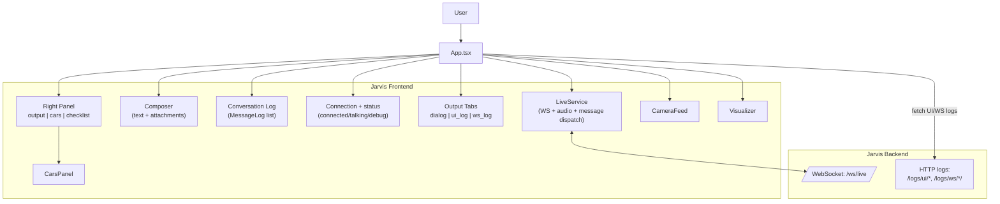

# UI

This file documents the high-level UI structure for `jarvis-frontend`.

Operator SSOT:
- `services/assistance/docs/ACTION.md`

API SSOT:
- Prefer the live backend OpenAPI: `GET /openapi.json`

## Structure (diagram)

## Explanation

- **`App.tsx`**
  Owns the primary UI state:
  - Connection lifecycle (`CONNECTED`/`DISCONNECTED`)
  - Conversation log (`MessageLog[]`)
  - Output mode tabs (`dialog`, `ui_log`, `ws_log`)
  - Right panel selection (`output`, `cars`, `checklist`)
  - Attachment staging (image/pdf/text)

- **`LiveService`**
  A stateful service object created by `App.tsx` that encapsulates:
  - WebSocket connection management and reconnect behavior
  - Microphone audio capture + streaming (when enabled)
  - Backend message decoding and routing into UI callbacks (e.g. `onMessage`, `onVolume`, `onCarsIngestResult`)

- **Core UI components**
  - `Visualizer`: renders mic level / audio activity.
  - `CameraFeed`: captures frames (used for vision features).
  - `CarsPanel`: shows results from `cars_ingest_image` / `cars_ingest_result`.

- **Logs tabs (`ui_log` / `ws_log`)**
  - `ui_log` is persisted locally (localStorage) and also flushed to the backend (`/logs/ui/append`) as best-effort.
  - `ws_log` is fetched from the backend (`/logs/ws/today`).

## Invariants

- The UI should tolerate backend reconnects and transient errors.
- Deterministic control-plane messages are handled by the backend and appear as normal system entries in the UI log.